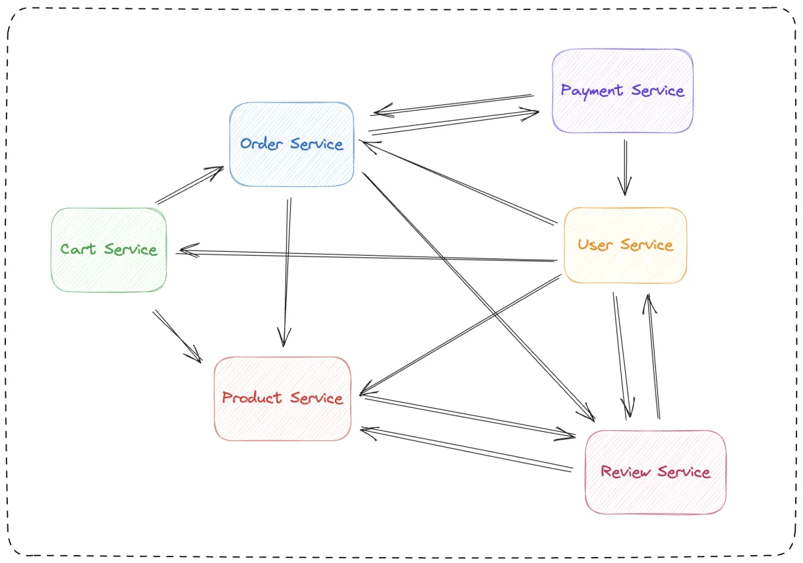
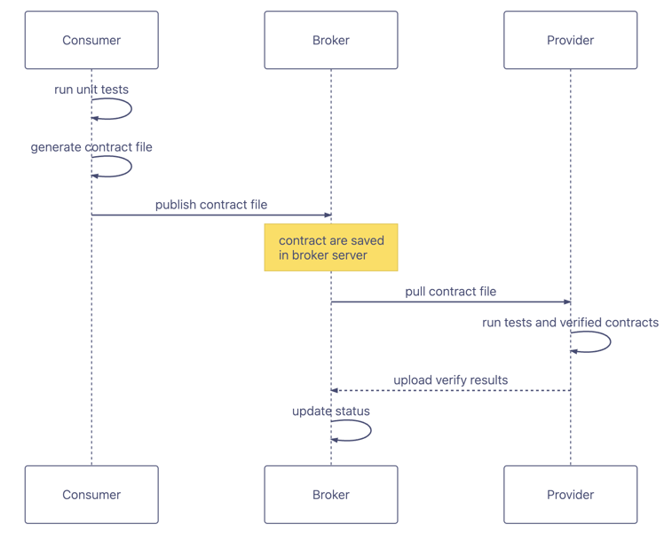

## 速览

### 通过这篇博客，你可以学习到：

-   契约测试解决了什么问题
-   消费者驱动的契约测试的主要概念
-   消费者驱动的契约测试的运行机制
-   契约测试的 Broker 是什么，有什么用
-   使用 PactFlow，基于 Springboot 和 Kotlin 的代码实践

### 你不能学习到：

-   提供者驱动的契约测试
-   双端驱动的契约测试
-   针对于消息队列的契约测试

但是，知识都是相通的。经过消费者驱动的契约测试的学习，相信你对于其他类型的契约测试也能快速上手 : )

## 契约测试是什么

契约测试（Contract Testing）是一种软件测试方法，旨在验证不同系统或组件之间的接口契约是否得到满足。这么说可能有一些抽象，所以我们可以先尝试通过一个例子来解释它存在的意义。在回答 “契约测试是什么”这个问题之前，我们有必要先理解它的存在解决了什么问题。

## 解决了什么问题

我们试想这么一个简单的场景：

我们现在有一个购物商城系统，当用户下单时，会调用系统的 API 来创建的一个订单。Order 服务依赖于上游的User 服务来获取用户的具体信息。Order 服务和 User 服务分别由两个团队开发。  


于是乎，他们口头约定了一下接口返回，就开始各自的开干了。User 服务的团队提供了一个查询用户信息的接口，并编写了集成测试。Order 服务基于大家的口头约定实现了调用请求并消费的代码，并且 mock 了上游服务（User）的接口返回。等到服务上到测试环境时，出现了一点小问题，两边对于 id 类型的理解其实有一些偏差，一边使用了 string，一边使用了 integer，但是通过讨论大家很快又达成一致了。总得来说，大家配合的还算不错。

随着时间的推移，购物商城系统的开发进入了中期，繁杂的业务让整个系统被拆分成了许多个微服务。相应的，团队的数量增加了，研发团队的人数也达到了几十个人。问题逐渐暴露了出来...

依旧是那个那个购物商场系统，随着业务演进，它的微服务依赖关系变成了这样：



现在对于负责每一个服务的 team 而言，新的需求变动到来，接口的变更变得困难起来。例如对于 Product 服务而言，它希望对/api/product/{id}接口的中用来表示商品状态的 status 字段进行修改，它就需要先收集的下游消费者的对该接口的使用场景，从而确定能否修改， 这存在的不小的工作量。所以实际开发中可能大家会拍脑袋就改了。然后，问题就会等到上到测试环境后暴露出来, 甚至由于下游团队并不知情接口变动或者双方对变更的理解不一致，问题可能会被带到生产。这太糟糕了，对吧？实际上，这种问题在许多大型团队中正在真实上演，滞后的问题暴露进一步导致了更大的修复成本。

**而这恰恰这就是契约测试所要解决的关键问题**。当你拥有多个下游消费者时，难以确保没有影响你的消费者。契约测试的出现守护了服务提供者和众多下游消费者之间的接口约定，并且通过它，我们阻止了上游服务端将破坏性的接口部署至环境。

那有朋友可能就会问了，那集成测试不可以吗？集成测试只能保证好基于团队上一次沟通的结果的测试验证，如果你这么请求我的接口，我就那么返回。但是我们很难确保在多团队的微服务项目中，消费者和上游服务对齐到位，上游服务每次都会针对每个消费者的具体使用场景补全集成测试，对吧？如果上游服务偷偷（指没有提前告知）就改了接口，那么我们可能到集成环境才能够发现问题了。

这时候如果团队之间使用契约测试的方式，这个问题我们就可以有效避免了。作为消费者，我们会发布契约文件到**契约仓库**中，契约文件是基于我们实际会发生的请求和期望的结果编写。上游服务在进行流水线构建时会从契约仓库拉取契约文件，并基于契约文件对它的是否满足每一个消费者和它之间的契约进行验证。这保证了在持续集成的过程中，各个团队部署在集成环境上的服务一定都是可用的。这里值得一提的是，如果使用的是 Pact Broker 这样的契约仓库，通过它提供的 Webhooks，提供者对契约变更的感知甚至可以前移到消费者发布契约时。

所以讲到这里，大家应该明白契约测试是什么了。简单点说，契约测试是为确保两个独立的系统或者微服务能够兼容并可以相互通信的一个方法，它可以确保消费者发送或接收的消息符合双方“契约”中记录的共同理解。

那么又有小伙儿伴会问了，那它相比普通的集成测试还有 e2e 测试有什么不同呢？普通的集成测试其实只覆盖了很少一部分的 happy path，一般不会对所有的 use case 进行覆盖。相比较而言，契约测试是对所有下游消费团队对这个接口的实际使用场景进行覆盖，因为“我是消费者，所以我最清楚自己想要什么”，所以它补足了每个消费者实际使用场景的测试空缺。而对于 e2e 测试来说，它更倾向于验证整个系统的功能和性能，这种测试往往实现的成本更大，复杂度更高，他们的侧重点有所不同。

## 主要的概念

在更进一步之前，我们需要先了解一些相关术语（好让自己显得专业一些 : )

### Customer

指代利用另一个应用程序的功能或数据来完成其工作的应用程序。对于使用 HTTP 的应用程序，消费者始终是发起 HTTP 请求的应用程序（例如 Web 前端）。在消费者驱动的契约测试的上下文里，它是负责生成的契约文件的一方。

### Provider

通过 API 提供功能或数据供其他应用程序使用的应用程序（通常称为上游服务）。对于使用 HTTP 的应用程序，提供者是返回响应的应用程序。在消费者驱动的契约测试的上下文里，它是负责拉取契约文件并进行校验的一方。

### Pact

消费者和提供者之间的接口约定文件称为契约 (Pact)。每个契约文件都是交互的集合。每个交互都描述了预期的请求 url 和预期的响应, 它是一份像这样的 json 文件：

```json
{
  "consumer": {
    "name": "consumer"
  },
  "interactions": [
    {
      "description": "test interaction",
      "providerStates": [
        {
          "name": "state 1"
        }
      ],
      "request": {
        "method": "GET",
        "path": "/order"
      },
      "response": {
        "body": {
          "id": 1
        },
        "headers": {
          "Content-Type": "application/json"
        },
        "status": 200
      }
    }
  ],
  "metadata": {
    "pact-jvm": {
      "version": "4.6.7"
    },
    "pactSpecification": {
      "version": "3.0.0"
    }
  },
  "provider": {
    "name": "provider"
  }
}
```

这里面描述了 Provider 和 Consumer 的名称，期望他们发生的交互，发生这些交互之前 Provider 需要切换到的 State 等等。

### Pact Broker

刚刚我们提到消费者和提供者之间通过契约文件进行验证，那么为了交换契约文件， 共享契约文件，我们就需要一个仓库来做这样的事情。我们当然也可以使用S3 buckets之类的OSS 来做这样的事情，但是 [Pact Broker](<https://docs.pact.io/pact_broker>)可以帮我们做的更好。它是一个**契约仓库**的解决方案，它解决消费者和提供者项目之间如何共享合约和验证结果的问题。除此之外，它还实现了许多强大的功能，包括但不限于契约依赖的可视化，多服务多环境多版本之间的契约校验，Webhooks等等，感兴趣可以点击链接深入了解。  
  


上面就是在系统中搭建契约测试需要涉及的几个重要概念。那么，他们是怎么配合工作的呢？

## 运行的机制

我们可以通过一个图来对**消费者驱动的契约测试**进行简要的概述：



契约测试的工程流程其实十分简单，总得来说就是**消费者在执行隔离测试期间需要生成契约文件，上传到契约仓库；提供者从仓库拉取契约文件，运行测试校验并上传验证结果**。

上面的图我们可以分成两部分来看，那就是 Consumer -> Broker 和 Broker -> Provider。

### 从 Customer 到 Broker

对于消费者驱动的契约测试来说（没错，还有服务端驱动的契约测试和双端驱动的契约测试，这里我们不加以赘述），Customer 基于和 Provider 商定的契约编写一个单元测试，它需要向 mock server 发起真实的请求，契约测试框架会记录下这个行为，并生成相应的 Pact 文件。

当单元测试通过并成功生成契约文件之后，消费者需要将契约文件上传到 Pact Broker 上，这一步可以本地使用命令行完成，但是我们通常会将这个操作集成到流水线上以实现自动化。

### 从 Broker 到 Provider

Provider 需要在流水线上集成从Pact Broker拉取契约的操作。当 Provider 在流水线上跑测试以准备部署到集成环境上时，会从 Pact Broker 拉取契约文件，并对这个文件记录的消费者行为进行重播（没错，就像 JOJO 里的替身忧郁蓝调），启动一个 mock client 根据契约文件真实的向服务发起请求，以校验是否能够获得契约里期望的响应。

测试结束之后，Provider 端可以选择上传验证的结果，以方便双方在可视化平台上看到结果以及使用一些 Broker 的增强功能。

这就是消费者驱动的契约测试的大概流程，看到这里，可能会有小伙伴提出这样一个问题，那这样岂不是只有 Provider 端主动跑流水线时才能感知到新的契约？

**并不是**，契约测试也可以在本地跑。Provider 在本地如果跑了契约测试就能发现契约更新了。那是不是非得 Provider 主动运行测试才能知道契约更新了？**也不是**，如果使用了像[PactFlow](https://docs.pact.io/pact_broker/webhooks) 这样的 Broker 平台，就可以通过 webhooks 实现这样的功能。Webhook 最常见的用途是在发布新内容 的 Pact 时触发提供者构建，并在发布提供者验证结果时触发消费者构建。

## 代码实践

### 代码背景

-   使用 PactFlow 平台作为契约仓库，它是一个托管的 Pact Broker 服务。
-   使用 Spring boot 框架和 Kotlin 语言编写测试，使用 [pact.io](http://pact.io/) 的契约测试框架  
    我们现在有两个服务，分别取名叫做 Consumer 和 Provider，Consumer 期望调用 Provider 的`/api/order`接口，获取 Order 数据，双方已经达成一致，我需要返回一个 Order id 为 1 的 Order。
    
你可以在[这里](<https://github.com/Rico00121/pact-demo>)找到代码 demo。

### Consumer 端

在 Consumer 端，我们需要:

-   配置上传契约仓库的url，访问token
-   配置一个httpClient来发起请求
-   编写我们的契约代码
-   基于契约 mock Provider的返回

我们在 Consumer 这边编写了如下的测试代码：

```kotlin
@PactConsumerTest
@PactTestFor(providerName = "provider", pactVersion = PactSpecVersion.V3)
class ConsumerApplicationTests {
    private val mapper = ObjectMapper()
    private val restTemplate = RestTemplate()
    private val headers = mapOf("Content-Type" to "application/json")

    @Pact(provider = "provider", consumer = "consumer")
    fun pact1(builder: PactDslWithProvider): RequestResponsePact {
        return builder
        .given("state 1")
        .uponReceiving("test interaction")
        .path("/order")
        .method("GET")
        .willRespondWith()
        .status(200)
        .headers(headers)
        .body(mapper.writeValueAsString(Order(id = 1)))
        .toPact()
    }

    @Test
    @PactTestFor(pactMethod = "pact1")
    fun testPact1(mockServer: MockServer) {
        val responseEntity = restTemplate.getForEntity(mockServer.getUrl() + "/order", Order::class.java)

        Assertions.assertEquals(HttpStatus.OK, responseEntity.statusCode )
        Assertions.assertEquals(1, responseEntity.body?.id )
    }
}
```

我们定义了一个声明了 `@Pact`注解的方法 `pact1`，它将会在运行测试前帮我们 mock 了 Provider 服务。此外，在这里我们定义了 `given("state 1")`，这是声明Provider 端在验证该契约之前，需要切换到 Provider 端的 `state 1` 状态，所谓状态就是类似于写单测的时候要 mock 外部的返回，我们需要 Provider 端预设一些合理的返回值。这确保了当生成的契约在 Provider 那边运行时，Provider 能够在运行该测试之前将自己切换到正确的状态从而返回合适的响应，因为一个接口可能会被多个消费者调用，不可能只通过一种 mock 的结果就可以验证所有的契约，所以需要 Provider 在验证每个契约时动态的进行状态切换。

当 Consumer 运行测试时，契约测试框架会通过在运行的过程中监听该测试的请求和响应，记录并生成契约文件，所以编写单元测试在这里是必要的。它不仅能帮助我们简化生成契约的过程，更能够帮助我们意识到我们在做什么。

### Provider 端

在 Provider 端，总得来说我们需要:

-   定义拉取契约文件的仓库 url，访问 token
-   设置 Provider 程序 state 的数据
-   配置用于运行请求从而进行契约校验的 Provider 应用

所以，Provider 编写了如下的测试：

```kotlin
@SpringBootTest(webEnvironment = WebEnvironment.DEFINED_PORT)
@Provider("provider")
@PactBroker(host = "xxx.pactflow.io", authentication = PactBrokerAuth(token = "my rw token"))
class ProviderApplicationTests {
    @MockBean
    lateinit var orderRepository: OrderRepository

    @TestTemplate
    @ExtendWith(PactVerificationSpringProvider::class)
    fun pactVerificationTestTemplate(context: PactVerificationContext) {
        context.verifyInteraction()
    }

    @State("state 1")
    fun switchToState1() {
        Mockito.`when`(orderRepository.getOrder(1)).then { Order(id = 1) }
    }

}
```

契约测试框架会基于注解提供的 host 和 token 来请求 PactFlow 平台，拉取契约文件解析到上下文中并执行测试校验。

可以发现这边我们声明了一个 state，“state 1” ,它就是我们刚刚提到的用来执行在 Consumer 端定义的测试之前切换状态的函数。在执行这个测试之前，框架会先一步按照契约里声明的那样调用相应的状态切换函数从而 mock 的外部服务（例如这里是数据库）的返回值，确保契约按我们期望的执行。

应用基于要验证的契约切换完状态之后，契约测试框架就会向测试启动的应用重播之前在 Consumer 端记录的行为并验证自身服务的返回是否也如同契约中期望的那样。

这里朋友们可能会纠结关于 Provider 的契约测试具体需要 mock 到哪一层的问题（接口往后的部分，还是数据库往后的部分？）。我想说消费者驱动的契约测试实际想要验证的是 Provider 的请求和响应是否和约定或者说 Consumer 期望的一致。所以只要团队内部达成一致，仅调用控制器层（或者是六边形架构中的适配器层）并存根下面的层，或者是仅隔离外部系统都是合适的，这需要具体问题具体分析。

以上就是契约测试的简单实现流程，其中的 Consumer 端发布契约，Provider 端拉取契约跑测试。在真实场景下应当是两个团队维护各自的服务，并会将发布拉取验证的操作集成进流水线以自动化工作流。只不过图方便，所以在该 demo 中没有做集成流水线的展示。

## 契约测试存在的一些问题

有些人可能觉得使用契约测试就可以弃用掉集成测试了，因为他们看起来都是测试了实际的业务场景。然而，集成测试依然有必要存在，因为测试依赖于消费者上传的契约，所以不能够覆盖全部的场景，依旧需要集成测试对其进行补充。

此外，使用成本不低。在落地契约测试的过程中存在着不小的 effort，包括让开发们学习理论知识，熟悉相关的技术框架，更重要的是，需要团队内部对其的理解达成一致。此外，契约测试落地之后还会带来一定的沟通成本，主要集中在确定新接口的契约内容。

另外值得提醒的是，在小项目中，契约测试的 ROI(Return on Investment) 不高。这是由于契约测试主要解决的是大型团队中下游消费者众多，沟通困难的问题，而这些问题在小型团队中并不显著。对于只有几个人的小型团队而言，面对面的沟通反而更加高效。

## 总结

在现代应用程序中，不同的服务或组件通常通过接口进行交互。这些接口定义了数据的传输格式、协议、请求和响应的约定等。契约测试的目标是确保参与接口交互的各个系统或组件在遵守接口契约方面保持一致。在本文中，我们介绍了什么是消费者驱动的契约测试，它的核心概念以及它的工作原理，并通过简单的例子加以说明。此外，我们也针对契约测试存在的一些问题进行了探讨。

总得来说，契约测试绝非银弹。对于小型团队来说，组内交流便捷的情况下无需投入精力使用契约测试，毕竟它有着一定的维护成本。而对于大型的跨团队项目来说，契约测试就显得尤其必要了，无论是维护微服务间的接口稳定性，定位问题，还是问责：）。当然，想要成功落地契约测试并取得收益也绝非易事，因为这需要团队切实存在着一些痛点，并且大家对契约测试的理解达成一致才行。