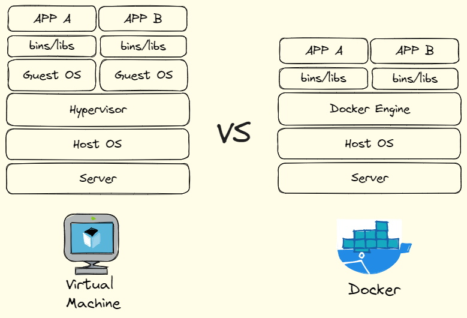
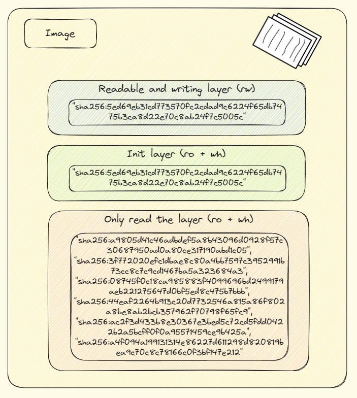

## Docker 是什么

如果你听说过 Docker ，并且使用过它，你可能知道这个名字的来源。Docker 取名自码头工人，这些工人负责搬运集装箱，将它们从一个地方搬到另一个地方。在计算机领域，Docker 同样是一个搬运工人，它负责搬运应用程序及其依赖，将它们从一个环境搬到另一个环境中。这正是容器化技术的具体实现，它通过镜像和容器的概念，将应用程序打包成一个可以移植的容器，从而实现了应用程序的轻量级打包与部署。

镜像（image）是 Docker 中的一个重要概念，它类似于安装操作系统的光盘。在 Docker 中，镜像是一种代码的可执行镜像，它由一些初始化数据和代码本身的二进制文件构成。容器是一个虚拟的安装好系统的计算机，它是由镜像启动而来的。通过 docker run 命令，我们可以快速的启动一个跑镜像对应软件的容器，从而实现了应用程序的运行。

容器（Container）其实是一种沙盒技术，顾名思义，沙盒就是能够像一个集装箱一样，把你的应用“装”起来的技术。这样，应用与应用之间就因为有了边界而不至于相互干扰。而被装进集装箱的应用，也可以被方便地搬来搬去。这种沙盒技术可以帮助我们更好地隔离不同的应用程序，避免它们之间的相互影响。同时，它也使得应用程序更加可移植，可以方便地在不同的环境中运行。

## 与传统的虚拟机有什么不同

Docker 和虚拟机都可以用来隔离应用程序和其依赖，从而实现应用程序的轻量级打包和部署。但是，它们的实现方式有所不同。



在虚拟机中，通过 Hypervisor 硬件虚拟化功能，模拟出了运行一个操作系统需要的各种硬件，然后在这些虚拟的硬件上安装了一个新的操作系统。而在 Docker 中，Docker 项目帮助用户启动的，还是原来的应用进程，只不过在创建这些进程时，Docker 为它们加上了各种各样的 Namespace 参数，从而实现了进程之间的隔离和资源管理。

相比虚拟机，Docker 的优势在于它的启动速度更快，资源占用更少。容器镜像的大小要小得多，这是因为容器镜像只包含操作系统的所有文件和目录，而不包含内核，他通过 Docker Engine 来执行系统调用（类似于Java程序要通过JVM）。它通常只有几百兆，而传统虚拟机的镜像则是一个磁盘的“快照”，所以磁盘有多大，镜像就至少有多大。

但是，Docker 也有一些限制，例如在 Linux 内核中，有很多资源和对象是不能被 Namespace 化的，例如时间。如果在 Docker 容器中执行修改时间的系统调用，整个宿主机的时间也会被修改。因此，在使用 Docker 部署应用程序时，需要多加考虑哪些资源和对象是可以被 Namespace 化的，以及它们的限制和安全性问题。虚拟机则可以完全隔离应用程序和其依赖，相对更加安全，但同时也需要更多的资源和运行成本。

综上所述，Docker 和虚拟机都有其优势和限制。在选择哪种技术时，需要根据具体的应用场景和需求来进行权衡。对于需要快速部署和轻量级隔离的应用程序，Docker 可能更适合；而对于对隔离和安全性要求更高的应用程序，虚拟机则可能更合适。

## Docker 解决了什么问题

想象一下，能够轻松包装应用程序以及其所有依赖项，然后在不同的开发，测试和生产环境中顺利运行。这就是开源 Docker 项目的目标。

Docker 作为一个开源的容器化平台，它的出现解决了许多应用程序打包和部署的难题。在容器技术兴起之前，应用程序打包和部署通常需要考虑众多的依赖（各种相互依赖导致的 dependencies hell）、环境和配置等问题，这使得应用程序的部署变得复杂且易错。而 Docker 通过容器镜像的概念，将应用程序及其依赖打包成一个可以移植的容器，从而解决了应用程序打包和部署的根本性难题。通过约束和修改进程的动态表现，Docker 为容器创造了一个清晰的“边界”，使得应用程序的部署和管理变得更加简单和可靠。

此外，Docker的出现奠定了像 Kubernetes（k8s）这样的容器编排技术的基础，它提供了一套基于容器构建分布式系统的基础依赖。使用 Docker 和 Kubernetes，开发人员可以更加方便地构建、部署和管理分布式应用程序，同时也可以更好地实现应用程序的横向扩展和高可用性。因此，Docker 被广泛地应用于云计算、DevOps 和微服务等领域，成为了现代软件开发和部署的重要基石之一。

## Docker 的底层技术原理

在谈论 Docker 的技术实现原理之前，我们有必要搞明白什么是进程，以便于我们更好的理解 Docker 容器。什么是进程？简单来说，我们打开任务管理器，或者在cmd输入ps命令看到的一个个有端口的条目，就是一个个进程，它是我们写的代码跑起来的程序。专业点说，进程是一个程序运行起来后的计算机执行环境的总和。对于进程来说，它的静态表现就是程序，一旦运行起来，它就变成了计算机里的数据和状态的总和（动态表现）。而容器，本质上就是一种特殊的进程。  
Docker 使用了Linux操作系统中的 Namespace 技术和 Cgroups 技术来实现容器化，实现了容器与宿主机之间的隔离和资源管理。

**Namespace**

Namespace 是 Linux 容器技术的核心之一，它负责封装、抽象、限制和隔离容器内的进程，使其看起来拥有自己的全局资源。它是 Linux 内核提供的一种隔离机制，它可以将全局系统资源，如进程ID、网络、文件系统、用户等，隔离到独立的命名空间中，从而实现进程之间的隔离。Docker 通过使用 Namespace技术，为容器提供了独立的进程空间、网络空间和文件系统空间等隔离环境，从而实现了容器之间的隔离。

**Cgroups**

Cgroups（control groups 的缩写）是另一个关键的 Linux 内核功能，用于限制、说明和隔离一组进程的资源使用。它也是Linux内核提供的一种资源管理机制，它可以限制进程的资源使用，如CPU、内存、磁盘IO等，从而实现对进程的资源控制。Docker 通过使用 Cgroups 技术，为容器提供了资源限制和控制的功能，例如可以限制容器的CPU使用率、内存使用量等。  
  


所以说，一个正在运行的 Docker 容器，其实就是一个启用了多个 Linux Namespace 的应用进程，而这个进程能够使用的资源量，则受 Cgroups 配置的限制。

我们可以通过下面命令进入运行中的 Docker 容器内部的bash shells：

```
docker exec -it my_container bash
```

当我们进入一个容器中, 并用 ls 命令查看当前文件目录时，我们就会看到容器的内部拥有一个完整的 Linux 系统目录（这里使用 mysql:8.0 镜像举例）：

```
bash-4.4# ls
bin   dev                         entrypoint.sh  home  lib64  mnt  proc  run   srv  tmp  var
boot  docker-entrypoint-initdb.d  etc            lib   media  opt  root  sbin  sys  usr
```

这其实是基于 Namespace 技术中的 Mount Namespace 来实现的。在容器技术中，Mount Namespace（挂载命名空间）扮演着重要的角色。它可以让容器中的应用程序看到一份完全独立的文件系统，实现了容器与宿主机之间的隔离。然而，需要注意的是，Mount Namespace 只隔离增量，而不隔离存量。具体来说：

-   当容器创建时,它会继承宿主机已经存在的文件系统挂载点,这部分是“存量”。
-   后续,容器内部如果新建或修改文件系统挂载点,这部分被隔离在该 Namespace 内,这部分才是“增量”。

这意味着，在容器启动之前，新创建的容器会直接继承宿主机的各个挂载点。因此，为了让容器的根目录看起来更真实，我们可以在容器启动的根目录下挂载一个完整的操作系统的文件系统，例如 Ubuntu 16.04 的 ISO。通过 Mount Namespace 隔离后，在容器启动后执行 ls / 命令，查看容器根目录，就可以看到 Ubuntu 的所有文件和目录，这个挂载在容器根目录上的文件系统就是所谓的“容器镜像”，也被称为 rootfs（根文件系统）。

聪明的小伙伴看到这里肯定会想到一个问题，我们在 Docker Hub 这样的容器仓库中存在着成千上万个 image，大部分的 image 里面除了封装了程序代码本身、运行程序所需要的依赖性之外，底层的 Linux 操作系统部分都是类似的，那 Docker Hub 岂不是要花很多的空间来存储这些重复的部分？另一方面，当我们改动了我们的程序代码，想要重新构建镜像时，岂不是又要将全部依赖都重建一次？为了解决这些问题，在 rootfs 的基础上，Docker 创新性地提出了使用多个增量 rootfs 联合挂载一个完整 rootfs 的方案(被称之为 AuFS，Advanced Multi-Layered Unification Filesystem)，这引入了容器镜像中“层”的概念。

还是拿 mysql 的 image 举例子：

```
PS C:\Users\rico0> docker image inspect mysql:8.0
[
    {
        //以上省略千字
        "RootFS": {
            "Type": "layers",
            "Layers": [
                "sha256:caefa4e45110eab274ebbdbc781f9227229f947f8718cee62ebeff1aac8f1d5b",
                "sha256:5ed69eb31cd773570fc2cdad9c6224f65db7475b3ca8d22e70c8ab24f7c5005c",
                "sha256:a9805d41c46adbdef5a8b43096d0928f57c30687950ad0a80ce317190abd1c05",
                "sha256:3f772020efc1dbae8c80a4bb7597c3952991b73cc8c7c9cd1467ba5a323684a3",
                "sha256:08745f0c18ca985883f4099696bd2499179aeb221275647d0bf5ed8c475b7bbb",
                "sha256:1c585189e67fdc2030c09ab748ad5fab930ca32eade2a28a290f3b17b35e32f7",
                "sha256:bd6b6a89e10a7cdc0eef1d4a90db1afd39a647aa075c92f595164eaf2069935f",
                "sha256:82a375517098b527686d74ce3e158e77deb7accde153ca19dd2207d9b14b5058",
                "sha256:44eaf2264b913c20d7732546a815a86f802a8be8ab2bcb357962f70798f65fc9",
                "sha256:ac2f3d433b8e30367e3bed5c72cd5fdd0422b2a5bcff0f0a95571459ce9b425a",
                "sha256:a4f094a199131314e86227d611298d820819bea9c70c8c78166c0f3bf147e212"
            ]
        },
        "Metadata": {
            "LastTagTime": "0001-01-01T00:00:00Z"
        }
    }
]
```

我们可以看到它有很多的“Layer”，他们是一个个累加态的文件，这些层自底向上大体上分为三类：只读层，Init层和可读写层（下述图标仅用于示例，并不代表真实的层级情况）。



首先是只读层，也就是最底层，它包含一些基础的系统组成部分，或者说共通部分。通过将这些共通部分放在只读层中，可以减少重复的文件上传到 Docker Hub，提高镜像的下载速度。

其次是 Init 层，类似于 Git 中的 .gitignore 文件。Init 层是 Docker 项目单独生成的一个内部层，专门用来存放 /etc/hosts、/etc/resolv.conf 等信息。用户往往需要在启动容器时写入一些指定的值，例如 hostname。但是，用户执行 docker commit 命令时只会提交可读写层，不包含这些内容。  
最后是可读写层，它在没有写入文件之前是空的。一旦在容器里进行了写操作，修改的内容就会以增量的方式出现在可读写层中。此外，AuFS 还会在可读写层创建一个 whiteout 文件，把只读层里需要删除的文件“遮挡”起来，从而实现软删除（因为只读层不可写）。  
对应于具体的 mysql: 8.0 镜像，那就是：

-   只读层：包含底层的运行 MySQL 的操作系统， MySQL 程序本身、配置文件和数据库基本文件。这些内容将保持不变。
-   Init层：包括 MySQL 服务的启动脚本和配置,这些脚本在容器启动时运行。
-   读写层：容器运行时生成的日志文件、临时文件、端口映射等,都存在这里。

通过这种分层的方式，容器镜像可以更加灵活和高效地管理和使用。当容器启动时，Docker 会将多个层联合挂载，构成一个完整的根文件系统。这也是 Docker 能够快速启动容器的原因之一。同时，由于每个层都是相对独立的，我们可以更方便地管理和更新容器镜像，只需要修改对应的层即可，而不必重新构建整个镜像。这也符合 Docker 的理念，即“一次建立，到处运行”。

## 总结

在本文中，我们首先对比了 Docker 和 传统虚拟机的异同。紧接着，我们介绍了由各种 Namespace 和 Cgroups 构成的隔离环境，这一部分我们称为“容器运行时”（Container Runtime），也就 Docker 容器的动态部分。接着，我们引入了容器镜像层级的概念，介绍了一组挂载在文件系统目录上的rootfs，也就是“容器镜像”（Container Image）部分，他们是容器的静态部分。相比于容器运行时，容器镜像部分更加重要，因为他们是真正承载信息的部分。  
我想 Docker 技术的核心价值就在于分层、隔离、简化部署。这使得开发者可以把更多的精力放在产品编码上，极大地提高工作效率。同时，Docker 技术的出现，也为后面像 Docker Swarm， Kubernetes 和 Amazon ECS 这样的容器编排技术的出现奠定了夯实的基础。

## References

1.  Merkel, D. (2014). Docker: lightweight linux containers for consistent development and deployment. Linux j, 239(2), 2.
1.  陈, 皓. (2015, April 16). DOCKER基础技术：LINUX NAMESPACE（上）. Coolshell. https://coolshell.cn/articles/17010.html
1.  张, 磊. (2018, August 27). *深入剖析 Kubernetes*. Coolshell. https://time.geekbang.org/column/intro/100015201?tab=catalog