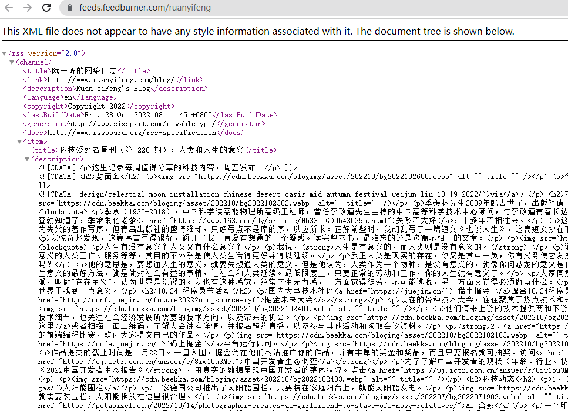

## 起因

在看阮一峰的个人博客时，发现右上角有个黄色的WIFI图标，这让我意识到我在很多个人博客上好像都看见过它。

顺着链接点进去，是一个xml格式的文件，以某种特殊的规范记录着博客上的信息。

在好奇心的驱动下，我对它进行了一系列的探索和尝试，最终产出了这篇博客，给大家分享一下这个有趣的“工具”。

## RSS
RSS的全称为 [RDF](https://zh.wikipedia.org/wiki/%E8%B3%87%E6%BA%90%E6%8F%8F%E8%BF%B0%E6%A1%86%E6%9E%B6) Site Summary，也有一部分叫它 Really Simple Syndication，翻译成中文就是**简易信息聚合**。RSS是一类消息来源格式规范的俗称，用以聚合多个网站更新的内容并自动通知网站订阅者。用来提供这样信息资源的规范都可以叫做RSS，常见的RSS规范有rss和atom两种，具体可以自行google。至于如何使用这种信息资源，那就不得不提到Feed。

## Feed
我们常常能听到Feed流的说法，Feed是用来关注和订阅网站的一类应用程序，它是一个能让你在**一个地方**订阅各种感兴趣网站的工具，或者说是阅读器。比较典型的用处就是订阅博客文章。

出于种种原因，许多博主都建了自己的私人博客站点，我们关注一两个博主还好，当我们同时关注许多博主时，由于他们的更新时间并不固定，我们常常不能第一时间得到消息。这时，Feed的优势就体现出来了，使用Feed阅读器，只需将喜欢博客的Feed流链接加到阅读器中，在自己的Feed阅读器上，就可以及时看到所有订阅的博主的资讯，自己已经读过的，自己还未读的，并且可以对所有的订阅随意的分类分栏。

Feed除了用于订阅自己喜欢的博主之外，理论上来说还可以订阅其他一切**会更新**的资源内容。你可以在你的Feed阅读器上，订阅你喜欢的up主，关注他的投稿更新；你可以添加你想关注的新闻网站的特定栏目，了解最新的新闻资讯；你可以添加你喜欢的淘宝店铺，关注它的商品上新；你可以订阅Github上的仓库，可以及时通知你仓库的更新，甚至是大学的教务网站公告栏……就像是文章标题说的一样，当你使用Feed，**万物皆可被订阅**。

## 常见的Feed阅读器
现在市面上比较常见的Feed阅读器就是 Feedly 和 Inoreader，当然如果是苹果用户，那么强推 Reeder 5，界面简约并且没有烦人的广告，不过麻烦的是这个应用在国区已经下架，需要费点功夫在美区下载。

当然，如果有一些特殊的需求，也可以在自己的服务器上自建Feed应用，例如 Tiny Tiny RSS 和 FreshRss。

至于如何快速获取想要订阅的网站的Feed链接，这里建议安装浏览器插件 RSSHub Radar，它可以帮助里快速找到当前页面，在互联网上有没有提供Feed链接，并且以帮助你一键把它订阅到你的Feed阅读器中。

## Feed的实现原理
通常来说，网站会提供给你一个Feed网址，一般是一个图标，可以直接点击跳转，但是也有一些藏在html格式的link标签里，需要自己好好找一找。用户只需将网站提供的网址登记到自己的Feed阅读器中，就可以订阅最新资讯了。

那么这时候有小伙伴就会问了，如果网站没有提供Feed接口该怎么办呢？那就只能自己写爬虫了，通过爬虫获取当前的网站html，并按rss或者atom的格式规范对数据进行转换，就可以给Feed阅读器使用了。

当然，不会自己写爬虫也没有关系，大神DIYGod已经在Github上开源了一个生成Feed链接的项目RSSHub，这是一个开源的，简单易用，易于拓展的RSS生成器，可以给任何奇奇怪怪的内容生成 RSS 订阅源。有兴趣的小伙伴可以自行查看它的[官方文档](https://docs.rsshub.app/)，目前已经生成了大部分你能想到的Feed源，比较常用的浏览器扩展 RSSHub Radar 也是基于此开发。

Feed阅读器的实现原理其实非常简单，订阅之后，阅读器通过轮询的的pull机制，每隔一段时间就通过接口调用遍历所有登记的网址，检查更新。阅读器获取到rss或者atom格式的数据之后，该以什么样式在阅读器上展示，显示哪些数据，那就是它的事了。

## 使用RSS的优势
使用RSS进行信息获取，我觉得有三点优势。首先，正如上文所提到的，它真正的做到了内容聚合，将你日常生活中的一切需要获取的资讯都整合到一处（追剧，比赛日程，喜欢的博主更新），让你免受各种APP的弹窗折磨。

其次，使用它进行消息订阅，不需要透露你的个人信息，你不需通过像其他社交软件那样，通过添加关注的方式，就能了解你想要关注的东西，这或多或少保证了你的关注隐私。添加Feed类似邮件，只不过邮件订阅还需要向网站提供邮箱地址，同时还可能存在垃圾邮件骚扰的困扰。

最后一点就是，使用RSS或者说是Feed，彻底杜绝了推荐算法的毒害。Feed表面上是进行资源聚合，其实远不止于此。如今，各类APP早已变得不再纯粹，各种推荐算法满天飞，知乎，小红书，抖音……推荐算法的存在让你越来越变得像**它所认为的你**，我们在无意识中被毫无意义的推荐内容浪费了太多的时间，却乐在其中。技术不应该用来掌控人类，使用RSS，能够给你一个**自己决定要看什么的机会**。

## 花絮
我在想格局如此之大的发明者，想必一定是一个了不起的人，于是在网上搜索了他或他们的信息。这让我了解到这么一个人，亚伦·希勒尔·斯沃茨，他参与开发了RSS消息來源发布格式、Markdown文本发布格式、知识共享组织、web.py网站开发框架，同时是社交媒体Reddit的联合创始人。于2013年去世，正直大好年华，对他的生平有兴趣的朋友可以观看记录片《互联网之子》，正在使用他所写的Markdown格式规范进行文章书写的我，为世界上少了一位真正的“斗士”，一名合格的软件开发者和文档贡献者感到可惜，一时间百感交集。

