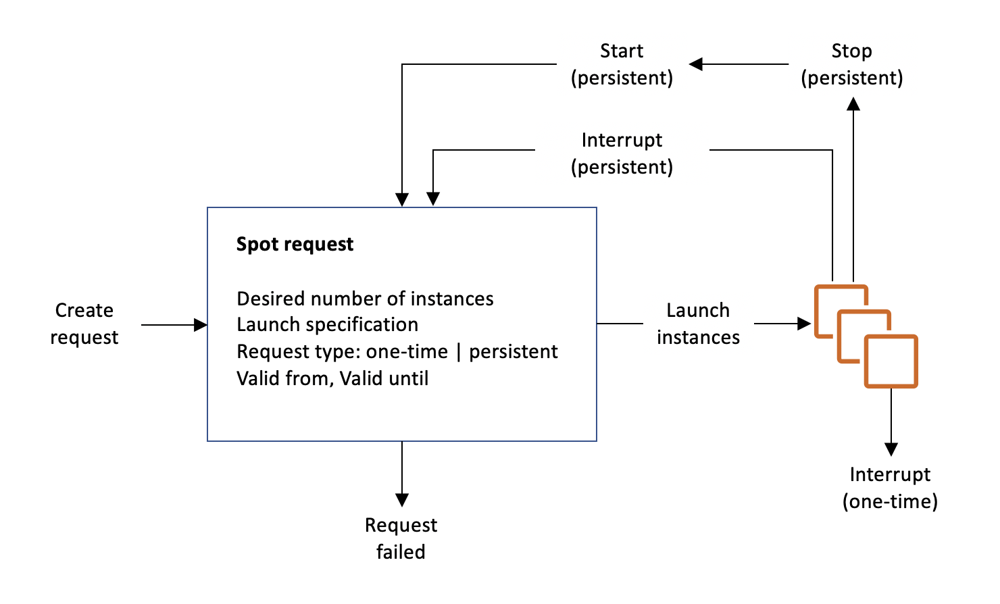

## Why Choose Spot Instances?

In the world of cloud computing, every penny saved is a penny earned! AWS EC2 Spot Instances are the ultimate cost-saving tool, offering prices **70%-90% lower** than On-Demand Instances! Sounds amazing, right? But as with all bargains, there are some tricks involved. Let's uncover the secrets behind them.

## What Are Spot Instances?

Spot Instances are an advanced AWS EC2 feature that allows you to run instances at a lower cost, but AWS reserves the right to reclaim these instances. If AWS decides to reclaim your instance, it will notify you and allow you to choose whether to continue running it. The biggest advantage of Spot Instances is their lower price compared to On-Demand Instances, but the main drawback is that AWS may terminate them. Simply put, Spot Instances are **temporary discount versions of AWS's surplus computing resources**. You just need to set a **maximum acceptable price (Max Spot Price)**, and if the market price falls below your set price, you can secure the instance.

## How Do Spot Prices Fluctuate?

AWS adjusts Spot Instance prices dynamically **based on market supply and demand** every hour.

If **current market price** > **your Max Spot Price**, AWS gives you a 2-minute grace period, during which you can choose:

- **Stop**: Shut down the instance without deleting it. EBS data is retained, but RAM data is lost. The instance resumes when prices drop.
- **Terminate**: Completely terminate the instance and restart a new one when AWS resources become cheaper.
- **Hibernate**: Pause the task, **saving memory data to EBS** (make sure your instance has enough EBS storage). When restarted, the instance restores its previous running state from EBS.

💡 **Tip:** Spot prices may remain low for extended periods during off-peak hours but fluctuate significantly during peak times. Setting an optimal Max Spot Price is crucial!

## Spot Request vs. Spot Fleet

### What Is a Spot Request?

A Spot Request is an individual request submitted to AWS to request one or more Spot Instances. It can be configured in the advanced details section when creating an EC2 instance by selecting **Spot Instance** as the purchase option.

#### How It Works

- **Submit Request**: Specify the maximum Spot price, instance type, region, etc.
- **Match Request**: AWS checks whether the current Spot price is below your bid and whether resources are available.
- **Instance Launch**: If resources are available, AWS launches your Spot Instance.
- **Task Execution**: Your instance runs as usual, taking advantage of the lower-cost computing resources.
- **Price/Capacity Changes**: If the Spot price rises above your bid or AWS experiences resource shortages, the instance may be terminated or stopped.
- **Termination/Retry**: If terminated, you can resubmit the request. If you enable persistent requests, the instance will restart automatically when the price is favorable.

### What Is Spot Fleet?

Spot Fleet is AWS's **"auto-bargain-hunting"** tool that allows you to request multiple Spot Instances at the same time. It dynamically adjusts instances based on price and availability to ensure workload stability.

#### Spot Fleet vs. Spot Request

- **Spot Request**: Requests only a single Spot Instance, and if terminated, you must manually request another.
- **Spot Fleet**: Manages multiple instances, automatically adjusting instance types and quantities to minimize interruptions.

#### Benefits of Spot Fleet

- **Smart Scheduling**: AWS automatically selects the cheapest and most stable Spot Instances.
- **High Availability**: Supports a mix of different instance types to reduce the risk of single-point failure.
- **Flexible Budget Control**: You can set a budget cap to prevent overspending.

💡 **Pro Tip:** Combine Spot Instances with **On-Demand** instances to improve overall stability!

## What Workloads Are Suitable for Spot Instances?

Spot Instances are best for **non-critical workloads**, meaning tasks that can be **interrupted** and **restarted**, such as:

✅ **Batch Processing Jobs**: Batch computation jobs are executed in chunks, and Spot terminations can be retried automatically.

✅ **Data Analysis**: Large-scale computing tasks don't require immediate responses, making Spot highly cost-effective.

✅ **Fault-Tolerant Workloads**: With proper architecture design, Spot interruptions won't impact the business.

💡 **Tip:** Many AI/ML training tasks can leverage Spot to save money! For example, deep learning model training can pause on Spot termination and resume later.

🚨 **However, avoid using Spot Instances for:**

❌ **Critical Jobs**: If a task interruption impacts business operations, it's too risky.

❌ **Databases**: Database failures can cause serious recovery issues.

## Ultimate Money-Saving Tips

Finally, let's summarize some money-saving strategies for Spot Instances. If you want to maximize the cost benefits of AWS Spot Instances, these strategies will help you get the most computing power at the lowest cost:

### **Tip 1: Choose the Right Instance Type**

Some instance types have consistently low Spot prices. Popular choices include **t3, m5, and c5**, which you should prioritize.

### **Tip 2: Use the Spot Advisor Tool**

AWS provides the [Spot Instance Advisor](https://aws.amazon.com/ec2/spot/instance-advisor/) to check historical pricing, stability, and other insights to help you find the best deals.

### **Tip 3: Combine Spot with On-Demand Instances**

Use **Auto Scaling Group (ASG)** with a mixed-instance strategy. For example, use **50% On-Demand + 50% Spot** to save costs while maintaining business continuity. ASG automatically scales based on workload demands and falls back to On-Demand instances when Spot resources are scarce, ensuring high availability while optimizing costs.

### **Tip 4: Launch Long-Running Tasks During Low-Price Periods**

Monitor price trends using the **AWS Spot Pricing API**, or use **AWS EventBridge + Lambda** to trigger Spot Instances during low-cost periods, maximizing savings.

## Conclusion

AWS EC2 Spot Instances offer an **exceptional cost-to-performance ratio**. If used wisely, you can **achieve maximum computing power at minimal cost**!

In summary, Spot saves money—**70%-90% cheaper than On-Demand instances**. It's ideal for batch computing but unsuitable for databases and critical workloads. Before using Spot, carefully determine which services can and cannot be replaced. You can also leverage **Auto Scaling Groups** to ensure Spot Instances automatically scale based on workload needs, improving flexibility and availability.
