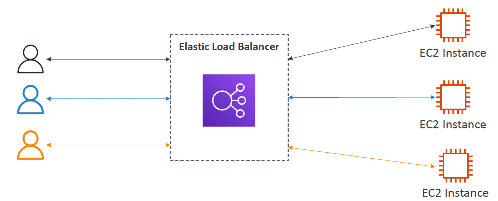
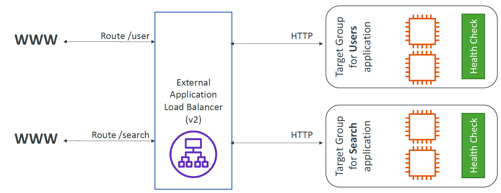

I believe everyone is familiar with high availability and scalability. Whether it's ensuring business continuity with "two locations and three data centers" or achieving elastic scaling to handle traffic surges, load balancers are indispensable key components. Today, based on my recent learning and practice experience, I will take you through a deeper understanding of AWS's Elastic Load Balancer and see how it helps us build an efficient, stable cloud architecture.

## What is a Load Balancer

Simply put, a load balancer is a set of servers specifically designed for **traffic distribution**. They are responsible for evenly forwarding incoming traffic to backend server clusters to provide efficient and stable services. It acts as a **unified traffic entry point**, allowing external visitors to not worry about the server structure behind it.

Load balancers use **intelligent routing algorithms** to allocate traffic appropriately. You can set routing rules based on **IP address, hostname, URL suffix**, and others to achieve more refined traffic control. It can also perform health checks through **Target Groups** to ensure traffic always flows to available servers and supports cross-availability zone traffic distribution, enhancing the system’s fault tolerance capability.

As a transit point for traffic, load balancers can provide additional processing capabilities. For example, you can perform **security checks** at the entry point to prevent malicious access; at the HTTP request level, it supports **SSL/TLS termination**, improving security and reducing the computational burden on backend servers. Furthermore, load balancers can maintain **session persistence based on cookies**, ensuring that requests from the same user always reach the same backend instance, thus improving user experience.

With these capabilities, load balancers not only enhance the system's availability and scalability but also play an important role in security and performance optimization.

AWS's Elastic Load Balancer provides powerful features and offers four different types of load balancers:

- CLB - Classic Load Balancer (v1 - old generation) – 2009
- ALB - Application Load Balancer (v2 - new generation) – 2016
- NLB - Network Load Balancer (v2 - new generation) – 2017
- GWLB - Gateway Load Balancer – 2020

Among them, Classic Load Balanc"Elastic Load Balancer (ELB)" was a product introduced by AWS in 2009, which now falls into the category of legacy products. However, with the rapid development of the network ecosystem in recent years, it can no longer meet the demands of modern high-concurrency applications due to its limited protocol support, simple routing algorithm features, and performance scalability strategy when faced with large-scale requests. Therefore, AWS no longer recommends using it. Nowadays, when choosing a sophisticated load balancer, we **avoid** using ELB and select either an Application Load Balancer (ALB) or a Network Load Balancer (NLB) based on our specific needs. Both are also simple and managed by AWS, which means we do not have to worry about the scalability issues of ELB when handling a massive influx of requests.

## Application Load Balancer

AWS's ALB is a load balancer operating at the seventh layer (Application Layer) of the ISO network model.

The so-called **seven-layer load balancing** operates at the application layer and deals with **HTTP protocols**. This means it is equipped with the capability to parse data such as URIs, hostnames, and query parameters within HTTP messages, and then forward them to backend servers using appropriate strategies.

AWS Load Balancers (LB) are not directly bound to multiple instances but rather use a concept called **Target Groups** to categorize multiple resources into a group. For ALB, these resources can be EC2 instances, IP addresses, Lambda functions, or other ALBs. Furthermore, target groups come with health check functionalities, meaning they can periodically request the health check port on our instances, allowing for timely traffic switching in case of a failure. The AWS ALB points to target groups instead of directly pointing to the instances themselves.

ALB is suitable for applications handling web traffic, such as websites, REST APIs, and microservices architectures. It supports **content-based routing**, allowing traffic allocation to different backend target groups based on the request's URL path or hostname. For instance, requests to `/api` can be routed to the API server, while `/static` requests can be routed to a storage server. Additionally, ALB supports **WebSockets**, **HTTP/2**, and provides **Sticky Sessions** and **AWS WAF (Web Application Firewall)** to enhance security.

Therefore, if your application requires routing based on HTTP header information, SSL termination, or if you are running web applications, API gateways, or backend services based on a microservices architecture, then ALB is the better choice.

## Network Load Balancer

AWS's **Network Load Balancer (NLB)** operates at the fourth layer (Transport Layer) of the ISO network model and mainly forwards traffic based on TCP, UDP, and TLS (encrypted TCP) protocols. Unlike ALB, which handles HTTP(S) requests, NLB focuses more on connection-level traffic management. It does not parse HTTP headers or cookies; instead, it forwards traffic directly based on target IP addresses, ports, and other information.

NLB is known for its exceptionally high throughput and low latency. Since it forwards traffic at the network layer, it can support **millions of concurrent** connections. Compared to ALB, NLB offers lower latency, making it particularly suitable for high-throughput scenarios such as financial transactions, real-time communications, and IoT applications. Additionally, NLB allows the use of **static IP addresses**, meaning it can bind an Elastic IP (EIP) within each Availability Zone (AZ), providing a more stable access method that avoids delays or IP change issues caused by DNS resolution. Note that if you use ALB, and your local DNS service does not cache or the TTL has expired, each request will need to pass through a DNS server, significantly increasing the response time.

When it comes to traffic proxying, NLB directly passes through TCP connections to backend servers without unpacking and inspecting the traffic, which enhances performance. This makes it very suitable for non-HTTP(S) services, such as database connections (MySQL, PostgreSQL, MongoDB), WebSocket, gRPC, or real-time applications that require low latency. Furthermore, like ALB, NLB also uses target group mechanisms to manage backend instances, allowing users to distribute traffic evenly to EC2 instances, IP addresses, Lambda functions, or even other NLBs (by letting the target group manage IP addresses since NLB is assigned a static IP), ensuring system scalability and high availability.

Overall, NLB provides an efficient way to manage and distribute traffic, better suited for applications requiring high concurrency, low latency, and direct TCP/UDP transmission.

## Gateway Load Balancer

**Gateway Load Balancer (GWLB)** is a load balancer introduced by AWS in 2020, specifically designed for network security devices. It operates atThe third layer of the ISO network model, known as the Network Layer, primarily handles traffic forwarding and inspection. Its core value lies in allowing users to transparently deploy and expand third-party security devices such as firewalls, intrusion detection systems (IDS), and intrusion prevention systems (IPS). It is compatible with third-party security products available in the AWS Marketplace, like those from Palo Alto Networks, Checkpoint, and Fortinet, enabling users to directly integrate these services without any additional configuration.

If you create your own Gateway Load Balancer (GWLB), you might feel confused about what third-party virtual appliances are. In this context, third-party virtual appliances refer to the aforementioned various security devices (like Palo Alto, Fortinet), which essentially are **EC2 instances** running these firewall software to inspect traffic.

A GWLB can only forward traffic to specific target groups, and the devices in these target groups are generally firewalls, intrusion detection systems (IDS/IPS), etc. However, it's important to note that the GWLB itself does not have the capability to automatically forward the inspected traffic to web servers or databases, so we need to configure the firewall devices to actively forward the traffic to the intended servers after inspection.

In the field of enterprise security, GWLB is applicable to scenarios such as enterprise-level firewalls, DDoS protection, traffic analysis, threat detection, and security in multi-cloud hybrid architectures. It ensures that the security devices in AWS network architectures can efficiently handle traffic without affecting the overall application performance.

## When to Use a Load Balancer

When your application's traffic continues to grow and a single server can no longer handle all the traffic, it is time to consider using a load balancer. It allows multiple servers to **share the load** of requests, ensuring the system can manage sudden traffic surges and prevent any single server from crashing due to overload.

In summary, load balancers are suitable for the following situations:

### **High Availability**

If you are building a **highly available** architecture and want to avoid single points of failure, a load balancer becomes indispensable. It can monitor the health status of backend servers in real-time, and if it detects any issues with an instance, it will automatically redirect traffic to properly functioning servers to ensure the application remains online at all times.

### **Scalability**

When your business requires *flexible scaling*, a load balancer allows you to easily add or remove servers without affecting the user experience. Coupled with AWS AutoScaling can automatically increase the number of servers during peak traffic times and reduce them when traffic decreases, ensuring performance and avoiding resource wastage.

### **Performance Optimization**

For scenarios that require **optimizing user access experience**, load balancers can also be effective. They can distribute traffic to the server closest to the user, reducing latency and improving response speed. If combined with caching strategies or a Content Delivery Network (CDN), you can further improve website access efficiency.

### **Security Enhancement**

If your application involves **security protection**, load balancers can also be helpful. For instance, an Application Load Balancer (ALB) can integrate with AWS WAF (Web Application Firewall) to effectively block malicious attacks, while a Gateway Load Balancer (GWLB) can work with firewalls, intrusion detection systems (IDS), and other security devices to ensure all traffic undergoes rigorous inspection before entering the system.

### **Support for Different Protocols**

Different types of load balancers are suitable for different business scenarios. For businesses running web applications, an ALB can distribute traffic based on URLs, hostnames, etc., and is very suitable for HTTP/HTTPS requests. If your application needs to handle high-concurrency TCP/UDP connections, such as database access, game servers, or real-time communication, an NLB might be a better choice. GWLB is primarily used for security protection and is suitable for enterprise-grade network security architectures.

### **Cross-Availability Zone Traffic Distribution**

When your system needs deployment **across multiple availability zones**, load balancers can help achieve automatic traffic switching. If a failure occurs in one availability zone, the traffic can automatically shift to servers in other zones, ensuring business continuity. You know, like implementing the so-called two-site three-center disaster recovery mechanism.

## Conclusion

AWS Elastic Load Balancer provides a comprehensive set of powerful traffic management capabilities, helping applications remain stable, efficient, and secure in a complex cloud environment. Whether dealing with web application requests with ALB, focusing on low latency and high throughput with NLB, or focusing on network security with GWLB, each plays a different role and is suitable for different business needs.

In practical applications, if your system requires **high availability, auto-scaling, performance optimization, or security enhancement**, a load balancer is an indispensable tool. Choosing the right load balancer not only makes your architecture more stable but also improves overall operational efficiency.

I hope this article helps you better understand AWS load balancers.Balance the ecosystem and choose the most suitable type of load balancer (LB). If you have more practical experience or questions about AWS load balancing, feel free to exchange ideas and discuss!