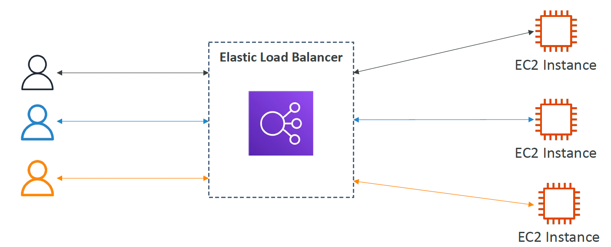
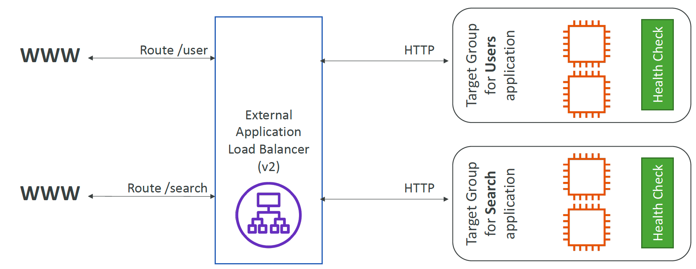

相信大家对高可用性和可扩展性都不陌生。无论是保障业务连续性的“两地三中心”，还是实现弹性扩展，应对流量激增，负载均衡器都是不可或缺的关键组件。今天，我就结合最近的学习和实践经验，带大家深入了解 AWS 的 Elastic Load Balancer，看看它如何帮助我们构建高效、稳定的云架构。

## 什么是负载均衡器

简单来说，负载均衡器是一组专门用于**流量分发**的服务器，它们负责将进入的流量均衡地转发到后端的服务器集群，以提供高效、稳定的服务。它充当了**统一的流量入口**，让外部访问者无需关心背后的服务器结构。

负载均衡器通过**智能路由算法**合理分配流量，你可以在其中设置基于 **IP 地址、主机名、URL 后缀** 等的路由规则，实现更精细的流量控制。同时，它还能通过**目标组（Target Group）** 进行健康检查，确保流量始终流向可用的服务器，并支持跨可用区的流量分发，提高系统的容错能力。

作为流量的中转站，负载均衡器还能为流量提供额外的处理能力。例如，你可以在入口处进行 **安全检查**，防止恶意访问；在 HTTP 请求层面，支持 **SSL/TLS 终止**，提高安全性并减少后端服务器的计算负担。此外，负载均衡器还能基于 **Cookie 维持会话粘性**，确保同一用户的请求始终落到相同的后端实例上，改善用户体验。

借助这些能力，负载均衡器不仅提升了系统的可用性和扩展性，同时也在安全性、性能优化方面发挥了重要作用。

AWS 的 Elastic Load Balancer 提供了强大的功能，它提供了四种不同的负载均衡器，分别是：

- CLB - Classic Load Balancer (v1 - old generation) – 2009
- ALB - Application Load Balancer (v2 - new generation) – 2016
- NLB - Network Load Balancer (v2 - new generation) – 2017
- GWLB - Gateway Load Balancer – 2020

其中， Classic Load Balancer 是 AWS 在 2009 推出的产品，它属于历史遗留产品，但是网络生态在这几年飞速发展，它支持的有限的协议，简单的路由算法功能和面对大规模请求时的性能扩展策略已经不在满足如今的高并发应用的需求。所以，AWS 已经不再建议使用它，现在当我们选择复杂均衡器时，我们会**避免**使用它，并基于我们的具体需求去选择 ALB 或者 NLB，他们也同样简单，且被 AWS管理，这意味着我们不用担心 ELB 在面临巨量请求时的弹性化问题。

## Application Load Balancer

AWS 的 ALB 是一个工作在 ISO 网络模型的第七层（Application Layer）的负载均衡器。

所谓的 **七层负载均衡** 就是指工作在应用层上，看到的是 **HTTP 协议**，这就意味着它被提供了能力去解析 HTTP 报文里的 URI、主机名、查询参数等数据，再用适当的策略转发给后端服务器。

AWS 的 LB 的并不是直接绑定多个实例， 而是通过一种叫做**目标组(Target Group)**的概念将多个资源划分为一个组。对于 ALB 来说，这些资源可以是EC2实例，IP address，Lambda 函数和其他的 ALB。此外，目标组还拥有健康检查的功能，这意味着它可以周期性的请求我们的实例上的健康检查端口，以便于在出现故障时及时的切换流量。我们的 AWS 的 ALB 指向的是目标组而不是直接指向实例本身。

ALB 适用于处理 Web 流量的应用，例如网站、REST API、微服务架构等。它支持**基于内容的路由**，可以根据请求的 URL 路径或主机名，将流量分配到不同的后端目标组（Target Group），例如 `/api` 的请求可以路由到 API 服务器，而 `/static` 的请求可以路由到存储服务器。此外，ALB 还支持 **WebSocket** 以及 **HTTP/2**，并提供 **Sticky Sessions（会话保持）** 和 **AWS WAF（Web Application Firewall）** 以增强安全性。

所以说，如果你的应用需要基于 HTTP 头信息进行路由、需要 SSL 终止、或者你正在运行 Web 应用、API 网关、基于微服务架构的后端服务，那么 ALB 是更好的选择。

## Network Load Balancer

AWS 的 **Network Load Balancer (NLB)** 是工作在 ISO 网络模型的第四层（Transport Layer）的负载均衡器，主要基于 TCP、UDP 和 TLS（加密 TCP）协议进行流量转发。与 ALB 处理 HTTP(S) 请求不同，NLB 更关注连接级别的流量管理，它不会解析 HTTP 头部或 Cookie，而是直接基于目标 IP 地址、端口等信息进行转发。

NLB 以其超高吞吐量和低延迟著称，由于它在网络层面进行流量转发，能够支持**百万级并发**连接，相比 ALB，NLB 的延迟更低，因此特别适用于需要高吞吐量的场景，例如金融交易、实时通信和物联网等应用。与此同时，NLB 允许使用**静态 IP 地址**，这意味着它在每个可用区（AZ）内都可以绑定一个 Elastic IP (EIP)，提供更稳定的访问方式，避免 DNS 解析导致的延迟或 IP 变更问题。要知道，如果使用的是 ALB，在你的本地 DNS服务没有缓存或者 TTL 过期的情况下，你的请求每个请求都需要经过一次 DNS 服务器，这大大增加了请求的相应时长。

在流量代理方面，NLB 直接透传 TCP 连接到后端服务器，不会对流量进行解包和检查，从而提升性能。这使得它非常适用于非 HTTP(S) 服务，如数据库连接（MySQL、PostgreSQL、MongoDB）、WebSocket、gRPC 或需要低延迟的实时应用。此外，NLB 和 ALB 一样，它也采用目标组 (Target Group) 机制管理后端实例，允许用户将流量均衡地分发到 EC2 实例、IP 地址、Lambda 函数，甚至是其他的 NLB（通过让目标组管理 IP 地址，因为 NLB 会被分配一个静态 IP），确保系统的可扩展性和高可用性。

总得来说，NLB 提供了一种高效的方式来管理和分发流量。它更适用于高并发、低延迟、需要 TCP/UDP 直接传输的应用。

## Gateway Load Balancer

**Gateway Load Balancer (GWLB)** 是 AWS 在 2020 年推出的一款专为网络安全设备设计的负载均衡器，它工作在 ISO 网络模型的第三层（Network Layer），主要用于流量转发和流量检查。它的核心价值在于，允许用户透明地部署和扩展防火墙、入侵检测系统（IDS）、入侵防御系统（IPS）等第三方安全设备。它兼容 AWS Marketplace 上的第三方安全产品，比如 Palo Alto Networks、Checkpoint、Fortinet 等，用户可以直接集成这些服务，无需进行额外的配置。

如果你自己创建一个 GWLB，你会感觉到很困惑。什么是三方虚拟应用(third-party virtual appliances)? 实际上，它这里的三方虚拟应用就是指的上文提到的各种安全设备（如 Palo Alto、Fortinet），安全设备本质上就是 **EC2 实例**，里面运行着这些防火墙软件，负责检查流量。

GWLB 只能将流量转发到特定的目标组中，而目标组中的设备一般是 防火墙、入侵检测系统 (IDS/IPS) 等。但需要注意的是 GWLB 本身没有设置可以把检查完的流量自动转发到 Web 服务器或数据库，所以我们需要让防火墙设备检查完流量后，主动转发到目标服务器。

在企业安全领域，GWLB 适用于企业级防火墙、DDoS 保护、流量分析与威胁检测，以及多云混合架构的安全防护等应用场景。它确保 AWS 网络架构中的安全设备能够高效处理流量，而不会影响整体应用性能。

## 什么时候应该使用负载均衡器

当你的应用访问量不断增长，单台服务器已经无法支撑所有的流量时，就应该考虑使用负载均衡器了。它可以让多个服务器共同**分担请求**，确保系统能够应对突发访问，同时避免某台服务器因超载而崩溃。

总得来说，负载均衡器（Load Balancer）适用于以下几种情况：

### **高可用性（High Availability）**

如果你正在搭建一个**高可用**的架构，并希望避免单点故障，那么负载均衡器也是必不可少的。它可以实时监测后端服务器的健康状态，一旦发现某个实例出现问题，就会自动把流量引导到正常运行的服务器，确保应用始终在线。

### **可扩展性（Scalability）**

当你的业务需要*灵活扩展*，负载均衡器可以帮助你轻松地添加或移除服务器，而不会影响用户体验。结合 AWS Auto Scaling，它可以在访问量高峰时自动增加服务器数量，在访问量下降时减少服务器，既保证了性能，又避免了资源浪费。

### **性能优化（Performance Optimization）**

对于需要**优化用户访问体验**的场景，负载均衡器同样可以发挥作用。它可以将流量分配到距离用户最近的服务器，减少延迟，提升响应速度。如果结合缓存策略或内容分发网络（CDN），可以进一步提升网站的访问效率。

### **安全性增强（Security Enhancement）**

如果你的应用涉及**安全防护**，负载均衡器也能帮上忙。例如，Application Load Balancer（ALB）可以与 AWS WAF（Web 应用防火墙）集成，有效阻挡恶意攻击，而 Gateway Load Balancer（GWLB）则可以与防火墙、入侵检测系统（IDS）等安全设备协作，确保所有流量在进入系统前都经过严格检查。

### **不同协议类型的支持**

不同类型的负载均衡器适用于不同的业务场景。对于运行 Web 应用的业务，ALB 能够根据 URL、主机名等进行流量分发，非常适合 HTTP/HTTPS 请求。如果你的应用需要处理高并发的 TCP/UDP 连接，比如数据库访问、游戏服务器或实时通信，NLB 可能是更好的选择。而 GWLB 主要用于安全防护，适用于企业级网络安全架构。

### **跨可用区（Multi-AZ）流量分配**

当你的系统需要**跨多个可用区**部署时，负载均衡器还能帮助你实现自动流量切换。如果某个可用区发生故障，流量可以自动转移到其他可用区的服务器，确保业务连续性。你懂的，例如实现所谓的两地三中心, 容灾机制。

## 总结

AWS Elastic Load Balancer 提供了一整套强大的流量管理能力，帮助应用在复杂的云环境中保持稳定、高效、安全。无论是处理 Web 应用请求的 ALB，专注于低延迟和高吞吐量的 NLB，还是用于网络安全的 GWLB，它们各自承担着不同的角色，适用于不同的业务需求。

在实际应用中，如果你的系统需要**高可用性、自动扩展、性能优化或安全增强**，那么负载均衡器绝对是不可或缺的工具。选择合适的负载均衡器，不仅能让你的架构更加稳定，还能提升整体的运维效率。

希望这篇文章能帮你更好地理解 AWS 的负载均衡生态，并选择最合适的 LB 类型。如果你有更多关于 AWS 负载均衡的实践经验或问题，欢迎交流探讨！
