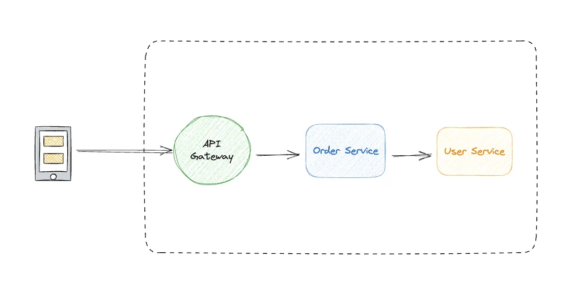
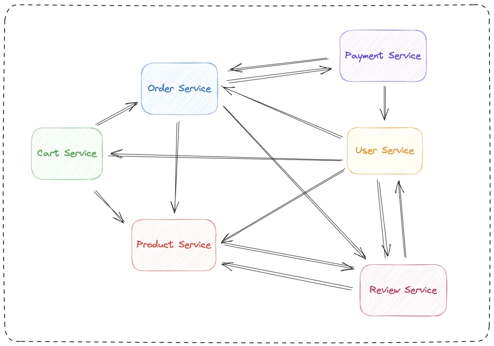
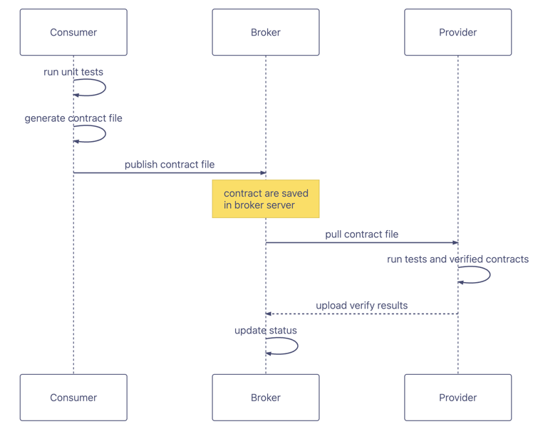

*Building Stable Large Distributed Systems with Consumer-Driven Contract Testing*

## Quick Overview
With this blog, you can learn:
- What problems contract testing solves
- Key concepts of consumer-driven contract testing
- The mechanics of running a consumer-driven contract test
- What is Broker for Contract Testing and what is it used for
- Code practices using PactFlow, based on Springboot and Kotlin

You can't learn:
- Provider-driven contract testing
- Dual-end driven contract testing
- Contract testing for message queues

*Whatever, the knowledge is all connected. After learning about consumer-driven contractual tests, I'm sure you'll be able to get up to speed quickly with other types of contract tests : )*

## What is Contract Testing

Contract Testing is a software testing methodology designed to verify that interface contracts between different systems or components are met.
There may be some abstraction in saying so, so we can first try to explain its existence through an example. Before answering the question "What is Contract Testing", it is necessary to understand what problem its existence solves. 

## What problem is solved
Let's imagine a simple scenario:

We have a shopping mall system, when a user places an order, it will call the system's API to create an order. Order service depends on the upstream User service to obtain specific information about the user. Order service and User service are developed by two teams respectively.



So they verbally agreed on the interface return, and started their own work. The team of User service provided an interface to query the user information, and wrote integration tests. the Order service implemented the code to call the request and consume it based on the verbal agreement, and mocked the interface return of the upstream service (User). When the service is uploaded to the test environment, there is a little problem, the two sides of the understanding of the id type in fact there is some deviation, one side uses string, the other side uses integer, but through the discussion of everyone quickly reached agreement again. Generally speaking, everyone cooperated quite well.

As time went by, the development of the shopping mall system entered the middle stage, and the complicated business made the whole system split into many microservices. Accordingly, the number of teams increased, and the number of R&D teams reached dozens of people. Problems were gradually exposed...

It was the same shopping mall system, and as the business evolved, its microservice dependencies became like this:



Now, for the team responsible for each service, it becomes difficult to make changes to the interface as new requirements change. For example, if the Product service wants to change the `status` field of the `/api/product/{id}` interface to indicate the status of the product, it needs to collect downstream consumers' usage scenarios of the interface to determine if it is possible to change it, which is a lot of work. This is a lot of work, so in actual development, people may just change it. Problems are then exposed when they hit the test environment, and may even be carried over to production because the downstream team is unaware of the interface change or doesn't understand the change in the same way as the downstream team. That's too bad, right? In fact, this is a real problem in many large teams, where lagged exposure leads to greater fixing costs.

And that's exactly this is the key issue that contract testing is designed to address. When you have multiple downstream consumers, it is difficult to ensure that there is no impact on your consumers. The advent of contractual testing guards the interface conventions between the service provider and the many downstream consumers, and by doing so, we prevent the upstream server from deploying destructive interfaces to the environment.

So, some of you may ask what about integration testing? Integration testing can only ensure good test validation based on the results of the team's last communication, if you request my interface this way, I'll return it that way. But it's hard to ensure that in a multi-team microservices project, the consumers and upstream services are aligned, and that the upstream services will make up integration tests for each consumer's specific usage scenario every time, right? If the upstream service changes the interface on the sly (i.e., without telling us in advance), then we may not be able to find the problem until the integration environment.

This is a problem we can effectively avoid if we use contract testing between teams. As a consumer, we publish a contract file to the contract repository, which is written based on the requests we will actually make and the results we expect. The upstream service pulls the contract file from the contract repository when it does its pipeline build and verifies that it meets the contract between each consumer, and it based on the contract file. This ensures that the services deployed by each team on the integration environment must be available during the continuous integration process. It is worth mentioning here that if you are using a contract repository such as Pact Broker, the provider's awareness of contract changes can even be moved forward to the time when the consumer publishes the contract through the Webhooks it provides.

So you should understand what contract testing is. Simply put, contract testing is a method of ensuring that two separate systems or microservices are compatible and can communicate with each other to ensure that the messages sent or received by the consumer conform to the common understandings documented in the "contract" between the two parties.

Moreover, what is the difference between integration testing and e2e testing? Ordinary integration tests only cover a small part of the happy path, and generally do not cover all the use cases. In contrast, contract testing covers the actual use cases of the interface by all the downstream consumer teams, because "I am the consumer, so I know what I want the most", so it fills in the gaps in the actual use cases of each consumer. For e2e testing, it is more inclined to verify the functionality and performance of the whole system, and this kind of testing is often more costly and complex to realize, and their focuses are different.

## The main concepts
Before we go any further, we need to understand some of the relevant terminology.

### Customer
Referring to an application that utilizes another application's functionality or data to do its job. For applications that use HTTP, the consumer is always the application that initiates the HTTP request (e.g. a web front-end). In the context of consumer-driven contract testing, it is the party responsible for the generated contract file.

### Provider
An application that provides functionality or data through an API for use by other applications (often called an upstream service). For applications that use HTTP, the provider is the application that returns the response. In the context of consumer-driven pact testing, it is the party responsible for pulling the pact file and validating it.

### Pact
The interface convention file between a consumer and a provider is called a pact. Each pact file is a collection of interactions. Each interaction describes the expected request url and the expected response, which is a json file that looks like this:
```json
{
  "consumer": {
    "name": "consumer"
  },
  "interactions": [
    {
      "description": "test interaction",
      "providerStates": [
        {
          "name": "state 1"
        }
      ],
      "request": {
        "method": "GET",
        "path": "/order"
      },
      "response": {
        "body": {
          "id": 1
        },
        "headers": {
          "Content-Type": "application/json"
        },
        "status": 200
      }
    }
  ],
  "metadata": {
    "pact-jvm": {
      "version": "4.6.7"
    },
    "pactSpecification": {
      "version": "3.0.0"
    }
  },
  "provider": {
    "name": "provider"
  }
}
```
This describes the names of the Provider and Consumer, the interactions they are expected to have, the State that the Provider needs to switch to before these interactions can occur, and so on.

### Pact Broker
We just mentioned that consumers and providers authenticate with a pact file, so in order to exchange and share pact files, we need a repository to do this. Of course, we can use OSS like S3 buckets to do this, but [Pact Broker](https://docs.pact.io/pact_broker) can help us do it better. It is a contract repository solution that solves the problem of how contracts and validation results are shared between consumer and provider projects. In addition , it also implements many powerful features , including but not limited to contract dependency visualization , multiservice multienvironment multi-version contract validation , Webhooks and so on , interested in clicking the link to learn more.

Above are a few important concepts that need to be involved in building a contract test in a system. And then, how do they work together?

## Mechanisms of operation
We can provide a brief overview of consumer-driven contract testing with a diagram:



The workflow of contract testing is actually very simple. In general, the consumer needs to generate the contract file during the execution of the isolation test and upload it to the contract repository; the provider pulls the contract file from the repository, runs the test validation and uploads the validation results.

The above diagram can be divided into two parts: Consumer -> Broker and Broker -> Provider.

### From Customer to Broker
For consumer-driven contract testing (yes, there are also server-driven contract testing and dual-driven contract testing, which we won't go into here), the Customer writes a unit test based on the contract agreed upon with the Provider, and it needs to make a real request to the mock server, which is logged by the contract testing framework, which generates the corresponding The contract test framework will record this behavior and generate the corresponding Pact file.

After the unit test passes and the Pact file is successfully generated, the Consumer needs to upload the Pact file to the Pact Broker. This can be done locally using the command line, but we usually integrate this operation into the pipeline for automation.

### From Broker to Provider
The Provider needs to integrate the pulling of contracts from the Pact Broker in the pipeline. When the Provider is running tests in the pipeline in preparation for deployment to the integration environment, it pulls the contract file from the Pact Broker, replays the consumer behavior recorded in this file (yes, it's like the JOJO stand-in for the melancholy blues), and launches a mock client that actually makes a request to the service based on the contract file to verify that it gets the response it expects from the contract. to verify that it gets the response it expects from the contract.

At the end of the test, the Provider side can choose to upload the results of the validation to make it easier for both parties to see the results on the visualization platform and use some of the Broker's enhancements.

This is the approximate flow of consumer-driven contract testing, see here, there may be a small partner may raise such a question, so it is not only the Provider side of the initiative to run the pipeline to sense the new contract? 
No, the contract test can also be run locally, Provider in the local contract test if you run the contract test can find the contract update. Does the Provider have to actively run the test to realize that the contract has been updated? No. If you use a Broker platform like [PactFlow](https://docs.pact.io/pact_broker/webhooks), you can do this with webhooks. The most common use of webhooks is to trigger a provider build when a Pact is published with new content, and a consumer build when the provider validates the results. Webhooks are most commonly used to trigger provider builds when posting new content to a Pact, and consumer builds when posting provider validation results.

## Code Practices
### Some backgrounds
- Uses the PactFlow platform as a contract repository, which is a hosted Pact Broker service.
- Writing tests using the Spring boot framework and Kotlin language, using pact testing framework from pact.io
- We now have two services named Consumer and Provider. Consumer expects to call Provider's `/api/order` interface to get Order data, and both sides have agreed that I need to return an Order with Order id 1.

You can find Demo code repository [here](https://github.com/Rico00121/pact-demo).

### Consumer side
On the Consumer side, we need to
- Configure the url for uploading the contract repository and accessing the token
- Configure an httpClient to initiate the request.
- Write our contract code
- Mock Provider returns based on the contract

We wrote the following test code on the Consumer side:
```kotlin
@PactConsumerTest
@PactTestFor(providerName = "provider", pactVersion = PactSpecVersion.V3)
class ConsumerApplicationTests {
    private val mapper = ObjectMapper()
    private val restTemplate = RestTemplate()
    private val headers = mapOf("Content-Type" to "application/json")

    @Pact(provider = "provider", consumer = "consumer")
    fun pact1(builder: PactDslWithProvider): RequestResponsePact {
        return builder
        .given("state 1")
        .uponReceiving("test interaction")
        .path("/order")
        .method("GET")
        .willRespondWith()
        .status(200)
        .headers(headers)
        .body(mapper.writeValueAsString(Order(id = 1)))
        .toPact()
    }

    @Test
    @PactTestFor(pactMethod = "pact1")
    fun testPact1(mockServer: MockServer) {
        val responseEntity = restTemplate.getForEntity(mockServer.getUrl() + "/order", Order::class.java)

        Assertions.assertEquals(HttpStatus.OK, responseEntity.statusCode )
        Assertions.assertEquals(1, responseEntity.body?.id )
    }
}
```
We define a method `pact1` declaring the `@Pact` annotation, which will help us mock the Provider service before running the test. In addition, we define `given("state 1")`, which declares that the Provider needs to switch to state 1 on the Provider's side before validating the pact. This is similar to mocking external returns when writing a single test, and we need the Provider to have some sensible return values predefined. This ensures that when the generated contract is run on the Provider side, the Provider can switch itself to the correct state before running the test to return the appropriate response, because an interface may be called by multiple consumers, and it is not possible to validate all the contracts with only one mock result, so the Provider needs to dynamically switch the state when validating each contract. state switching for each contract as it validates it.

When Consumer runs a test, the contract testing framework records and generates the contract file by listening to the requests and responses of that test during the run, so writing unit tests is necessary here. It not only helps us to simplify the process of generating the contract but also helps us to realize what we are doing.

### Provider side
On the Provider side, in a nutshell we need to:
- Define the url of the repository to pull the contract file, and access the token.
- Set the data for the state of the Provider program
- Configure the Provider application to run the request and thus perform the contract validation.

So, Provider writes the following test:

```kotlin
@SpringBootTest(webEnvironment = WebEnvironment.DEFINED_PORT)
@Provider("provider")
@PactBroker(host = "xxx.pactflow.io", authentication = PactBrokerAuth(token = "my rw token"))
class ProviderApplicationTests {
    @MockBean
    lateinit var orderRepository: OrderRepository

    @TestTemplate
    @ExtendWith(PactVerificationSpringProvider::class)
    fun pactVerificationTestTemplate(context: PactVerificationContext) {
        context.verifyInteraction()
    }

    @State("state 1")
    fun switchToState1() {
        Mockito.`when`(orderRepository.getOrder(1)).then { Order(id = 1) }
    }

}
```
The contract testing framework will request the PactFlow platform based on the host and token provided by the annotation, pull the contract file and parse it into the context and perform the test validation.

You can see that we have declared a state, "state 1", which is the function we just mentioned to switch states before executing the test defined on the Consumer side. Before executing this test, the framework will first call the corresponding state switch function as declared in the contract to mock the return value of the external service (e.g. database in this case) to ensure that the contract is executed as we expect it to be.

After the application has switched states based on the contract to be verified, the contract testing framework will replay the behavior recorded on the Consumer side to the application that started the test and verify that the return of its own service is also as expected in the contract.

You may be wondering which layer to mock to for contract testing of the Provider (the interface back or the database back?). I would say that consumer-driven contractual tests actually want to verify that the Provider's requests and responses are as agreed upon or expected by the Consumer. So as long as the team agrees internally, it is appropriate to call only the controller layer (or the adapter layer in the hexagonal architecture) and stub the layers below it, or to isolate only the external system, which is a problem to be analyzed on a case-by-case basis.

The above is a simple implementation process of contract testing, where the Consumer side issues the contract and the Provider side pulls the contract and runs the test. In the real scenario should be two teams to maintain their own services, and will be released to pull the validation of the operation will be integrated into the pipeline to automate the workflow. It's just a matter of convenience, so we didn't show the integration pipeline in the demo.

## Some of the problems with contract testing
Some people may think that using contract testing means that integration tests can be discarded because they appear to be testing actual business scenarios. However, integration tests are still necessary because they rely on consumer uploaded contracts, so they can't cover all scenarios and still need to be supplemented by integration tests.

In addition, they are not cheap to use. The process of implementing contract testing involves a lot of effort, including getting developers to learn the theory, familiarize themselves with the technical framework, and, more importantly, agreeing on the understanding within the team. In addition, contract testing also brings some communication costs, mainly focusing on determining the content of the contract for the new interface.

It is also worth reminding that in small projects, the ROI (Return on Investment) of contract testing is not high. This is due to the fact that contract testing mainly addresses the problems of large teams with many downstream consumers and communication difficulties, which are not significant in small teams. For small teams with only a few people, face-to-face communication is instead more efficient.

## Summary
In modern applications, different services or components usually interact through interfaces. These interfaces define data transfer formats, protocols, request and response conventions, and so on. The goal of contract testing is to ensure that the various systems or components involved in interface interactions are consistent in adhering to the interface contract. In this paper, we introduce what consumer-driven contract testing is, its core concepts, and how it works, and illustrate it with simple examples. In addition, we also address some of the problems with contract testing.

Overall, contract testing is by no means a silver bullet. For small teams, there is no need to invest in contract testing when communication within the group is easy, as it has a certain maintenance cost. For larger, cross-team projects, contract testing is especially necessary to maintain the stability of interfaces between microservices, to locate problems, and for accountability :). Of course, it's not easy to successfully implement contract testing and reap the benefits, because it requires teams to have real pain points and a common understanding of contract testing.
