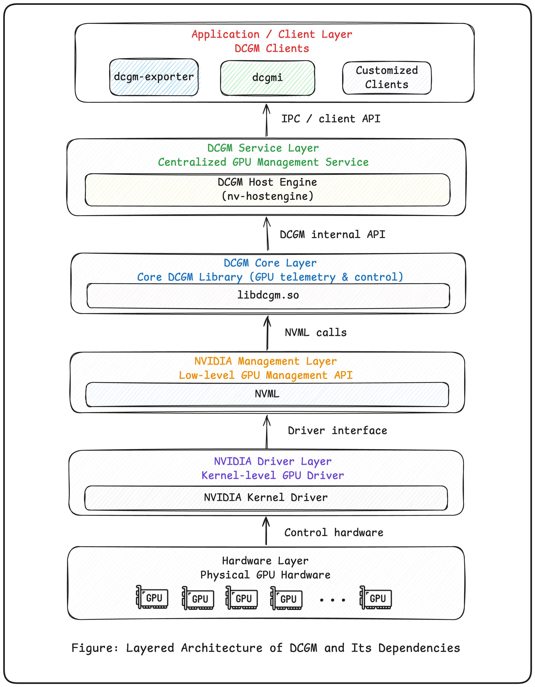
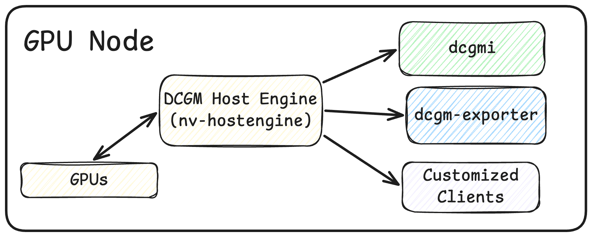

When people first get into the NVIDIA GPU tooling ecosystem, it is easy to get lost in a pile of overlapping names:

`NVML`, `NVIDIA-SMI`, `DCGM`, `DCGMI`, `DCGM Exporter`...

If you are working on GPU clusters, distributed training, or observability, these tools are hard to avoid. Recently, while learning more about GPU cluster infrastructure and contributing to a GPU observability system, I spent some time organizing how this toolchain actually fits together.

In this article, I want to answer a few practical questions:

1. What role does each tool play in the GPU ecosystem?
2. Why are NVML and NVIDIA-SMI not enough for cluster-scale GPU management?
3. What is DCGM, and what problems does it solve?
4. How is DCGM structured internally, and how does it work?
5. How should we use DCGM and the related tools in real engineering practice?

## The World Before DCGM

Before talking about DCGM, it helps to clarify a more basic idea first: what is a GPU node?

A GPU node is essentially a Linux-based compute instance. It might be:

- a bare-metal server
- a virtual machine
- or a container host

As long as the NVIDIA driver is installed, the system can recognize one or more GPU devices on that machine.

From that perspective, a node is an operating-system-level concept. In other words, when we talk about a node, we are really talking about a machine that runs an OS, not a specific software component.

Once that is clear, we can introduce one of the most important foundational pieces in the stack: NVML, the NVIDIA Management Library.

NVML is the low-level library NVIDIA provides for reading and managing GPU state. The familiar `nvidia-smi` command-line tool is built on top of it.

NVML was designed to be multi-GPU aware, so on a single machine it can manage several GPUs and expose things like:

- GPU utilization
- memory usage
- temperature and power metrics

But NVML also has a clear limitation:

> It gives you a device-level API, not a system-level management model.

That means NVML is closer to a query-and-control library. You can use it to inspect each GPU, but if you want to apply a consistent operation across many GPUs, such as batch configuration, unified monitoring, or coordinated health checks, you have to build that logic yourself.

If you want to run the same action across 8 GPUs in one node, NVML or `nvidia-smi` usually means iterating device by device. That creates a few obvious problems:

- you need extra code to manage the GPU list
- you have to implement your own batch-operation logic
- there is no higher-level abstraction for grouped management

## DCGM: Unified Management Through GPU Groups

That is exactly the gap DCGM, the Data Center GPU Manager, was designed to fill.

DCGM adds a higher-level abstraction on top of NVML, and one of its most important concepts is the GPU Group.

With GPU Groups, you can organize:

- all GPUs on a node
- or a selected subset of them

into a logical group.

Once you do that, configuration, status queries, and health checks can be performed against the group rather than against each GPU individually.

That is a meaningful shift:

> GPU management moves from single-device operations to collection-level management.

This is one of the core reasons DCGM matters.

So what exactly is the relationship between DCGM and NVML?

Architecturally, DCGM, including its core library `libdcgm.so`, is built on top of NVML.

NVML provides the low-level access to GPU state such as utilization, temperature, and power. DCGM does not reimplement that capability. Instead, it uses NVML as its hardware-facing layer.

But DCGM is much more than a thin wrapper. On top of NVML, it adds a higher-level management model that includes:

- GPU Groups
- Field Groups
- periodic collection and caching through Watch / Cache
- health checks and policy controls
- a multi-client access model centered around HostEngine

Put differently:

> NVML is more like a function library, while DCGM is a long-running management system.

An intuitive way to think about the difference is this:

- NVML: ask the GPU for its current state every time you need it
- DCGM: keep collecting and maintaining GPU state in the background, then serve a unified view to multiple clients

That shift from one-off polling to continuous observation is what makes DCGM suitable for data-center-scale GPU operations and observability.

## The Core Components of DCGM

Rather than listing every DCGM feature, it is more useful to understand the main building blocks in the system.

DCGM is not a single library. It is an ecosystem of components that work together to provide GPU management, monitoring, and observability.

The main pieces are:

1. `libdcgm.so`

This is the foundational shared library and the core implementation layer of DCGM. It mainly does two things:

- calls NVML to obtain GPU data
- exposes a unified API for metrics collection, error detection, and other basic capabilities

2. HostEngine

HostEngine, commonly started through `nv-hostengine`, is built on top of `libdcgm.so` and is arguably the most important DCGM component.

It is a long-running daemon responsible for:

- initializing and managing the DCGM lifecycle
- serializing or coordinating GPU access across clients
- collecting GPU metrics periodically
- exposing IPC and HTTP interfaces to external consumers

You can think of HostEngine as both the control plane and data plane of DCGM.

3. Client-layer applications

Because HostEngine acts as the service layer, most upper-level tools are effectively clients of it. These include:

- `dcgmi`, the standard command-line interface
- `dcgm-exporter`, which exposes metrics in Kubernetes and observability workflows
- custom internal or third-party tools built on top of HostEngine or `libdcgm.so`

In practice, these applications usually do not call `libdcgm.so` directly. They interact with GPU state through HostEngine.

The following diagram is a useful way to visualize how `NVML`, `libdcgm.so`, `nv-hostengine`, and `dcgmi` relate to one another:

## How DCGM Is Typically Used in Real Systems

For most users and day-to-day GPU cluster operations teams, HostEngine is the layer that matters most.

In a typical setup, such as a Kubernetes GPU cluster, each GPU node installs the DCGM package set, which often includes:

- `libdcgm.so`
- `nv-hostengine`
- `dcgmi`
- the runtime pieces needed for NVML-backed access

The operational model usually looks like this:

1. Start one `nv-hostengine` on each GPU node.
2. Connect all DCGM clients to that HostEngine instance.
3. Let HostEngine sample GPU state continuously in the background.

That deployment model can be visualized like this:

From there, different types of clients can consume the data or perform management actions:

- deploy `dcgm-exporter` as a DaemonSet so Prometheus can scrape GPU metrics
- log into a node and use `dcgmi` directly
- build custom internal clients on top of `nv-hostengine`

Among those, `dcgmi` is especially useful because it can operate on groups as well as inspect state.

## Why Multiple Clients Should Usually Share One HostEngine

There is one engineering detail here that is easy to miss but important in practice.

If you use `dcgm-exporter`, it may run with an embedded HostEngine by default. If you also start a separate node-level HostEngine, you can end up with two different data sources on the same node.

That leads to a common and confusing symptom: the GPU state reported through `dcgmi` does not match the metrics exported by `dcgm-exporter`.

The root cause is straightforward. They are not reading from the same HostEngine, so their sampling intervals, caches, and update timing can differ.

That is why NVIDIA generally recommends a shared-node model when multiple clients are involved:

- deploy one node-level `nv-hostengine`
- point `dcgmi`, `dcgm-exporter`, and custom clients to that same instance

This gives you several practical benefits:

- fewer metric inconsistencies caused by different sampling windows
- less duplicated collection work
- a more predictable and unified view of GPU state

## Conclusion: When DCGM Becomes Necessary

On a single machine, `nvidia-smi` and NVML are often enough. But once the environment grows into a GPU cluster, especially in Kubernetes or other cloud-native systems, the problem changes:

- how do you manage many GPUs consistently?
- how do you keep data consistent across multiple clients?
- how do you collect and expose metrics efficiently?

DCGM exists to solve those problems.

Through HostEngine, it provides a unified service entry point. Through concepts such as GPU Groups, Field Groups, and Watch, it gives you a more scalable collection model. Through Exporter integrations, it fits cleanly into modern observability stacks.

In practice, a common best-practice pattern looks like this:

- deploy one HostEngine per GPU node
- connect all clients to that HostEngine
- use Prometheus and Grafana to build the full GPU observability workflow

That approach gives you both consistency and operational leverage, which is exactly where DCGM becomes more useful than raw device-level tooling.
