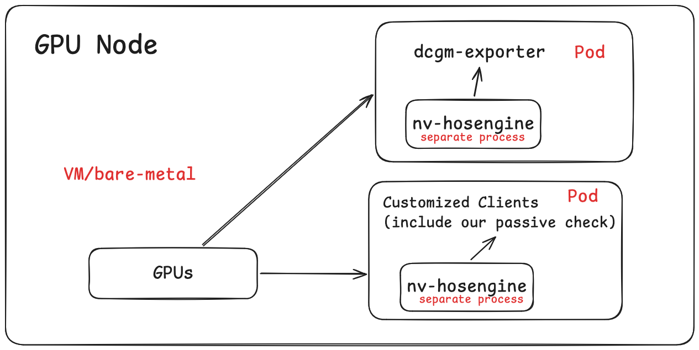
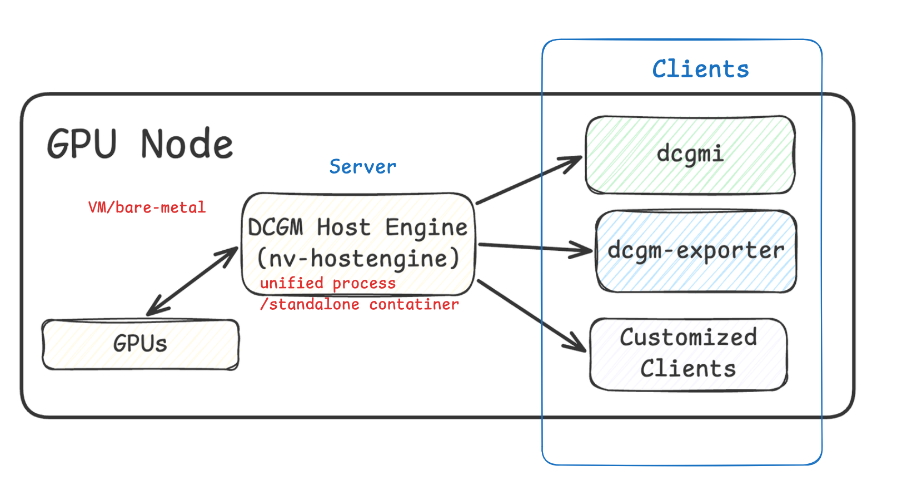
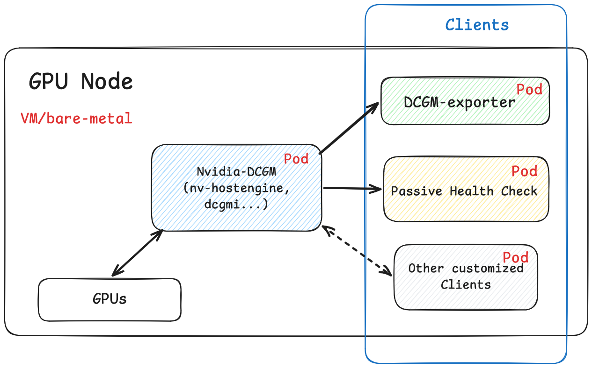

## 背景

最近一段时间我一直在负责公司 GPU 集群健康检查机制的构建。由于我们使用 Kubernetes 统一管理 GPU 集群，我们设计了一个以 DaemonSet 形式运行的**被动健康检查容器（Passive Health Check Pod）**，它部署在每一个 GPU 节点上，以高频率对节点可用性进行主动探测。

与此同时，我们也引入了 NVIDIA 官方的 `dcgm-exporter` 作为节点级别的 GPU 基础监控组件，将 GPU 指标暴露给 Prometheus。

关于 DCGM 的工作原理、`nv-hostengine` 是什么以及各组件之间的关系，可以参考[我之前写的这篇博客]()。

## 事情的起因：一次短暂的告警状态不一致

问题的导火索是一次短暂的假告警事件。

我们的被动健康检查容器在执行 DCGM health check 时，发现了某个节点 GPU 的电流不稳定异常；然而当我们同时查看 `dcgm-exporter` 的数据时，该节点的 GPU 状态却显示健康。

两个组件，同一台节点，却给出了截然相反的判断。我们很快意识到：**这里存在两个容器视图不一致的问题**，而不只是一次普通的误报。

重启健康检查容器之后，异常消失了。显而易见，我们可以通过每次重置 health check 中使用的 DCGM 实例来刷新缓存，从而解决问题。但我意识到这只是治标，根源一定在更深的地方。

## 深入调查：问题的根本原因

我花了一些时间深入研究了 DCGM 的底层工作原理，最终找到了问题的根因。

核心在于：**这两个 Pod 各自运行着独立的 `nv-hostengine` 实例**。

`dcgm-exporter` 在默认配置下，会在容器内部启动一个 Embedded Host Engine，而不是连接到节点级别的 Host Engine。我们自己的 Passive Health Check 容器也是如此，它同样内嵌了自己的 `nv-hostengine`。

这意味着整个节点上同时存在**两个彼此独立的数据采集进程**，它们各自维护自己的 GPU 状态缓存，采样时间不同、缓存内容不同，给出的结论自然也可能不同。

如下图所示（Current Architecture）：



这种架构存在以下具体问题：

**1. 内部引擎冲突（Internal Engine Conflict）**  
每个容器都启动了自己的 Embedded `nv-hostengine`，而不是共用节点层面的统一实例。这意味着冗余的资源浪费，多个 GPU 控制点。

**2. 状态视图不一致（Inaccurate Reporting）**  
每个容器看到的 GPU 状态，取决于其**自身内部**的 Host Engine 实例，而非节点的真实状态。一旦两个实例的采样时序或缓存状态出现差异，报告结果就会相互矛盾。

同时，这一点也能从 Nvidia 的 `dcgm-exporter` [官方文档](https://docs.nvidia.com/datacenter/dcgm/latest/gpu-telemetry/dcgm-exporter.html)中得到印证：

> Since dcgm-exporter starts nv-hostengine as an embedded process (for collecting metrics), appropriate configuration options should be used if dcgm-exporter is run on systems (such as NVIDIA DGX) that have DCGM (or rather nv-hostengine) running.

显而易见，我们需要对当前的部署架构做出一些改进。我们需要使用一个独立 `nv-hostengine`，确保统一的状态视图，统一的控制入口点。



## 改进策略与技术选型

### 为什么不是简单地合并到一个容器？

最直觉的方案是：把两个容器合并成一个，共用同一个 Host Engine。但这行不通，原因在于：

- `dcgm-exporter` 是上游开源项目，我们不应该修改它的内部实现
- 将监控采集逻辑和业务健康检查逻辑耦合在一个容器中，会导致职责不清、生命周期管理复杂

### 如何独立部署 `nv-hostengine`？

明确了需要将 `nv-hostengine` 独立出来之后，具体的落地方式有两种选择：

**选项一：在 VM / Bare Metal 层直接运行 `nv-hostengine` 进程**

这是 NVIDIA 官方文档中提到的做法：在节点操作系统层面直接启动一个 `nv-hostengine` 守护进程，所有容器内的 Client 通过网络连接到它。这种方式最接近“节点原生”，理论上也最稳定。

**选项二：将 `nv-hostengine` 封装成一个独立的容器（DaemonSet）**

我们最终选择了这个方案。原因有以下几点：

- **统一管理**：与其他组件保持一致，生命周期、配置、日志都通过 Kubernetes 统一管理，无需额外维护节点级别的进程
- **侵入性小**：不需要在每台 GPU 节点的操作系统上手动安装和配置 `nv-hostengine`，对基础设施层的改动降到最低
- **便于 troubleshooting**：未来的工程师可以直接通过 `kubectl exec` 进入容器进行调试，使用熟悉的云原生工具链排查问题，而不需要登录到宿主机上操作

### 方案讨论：三 Container 同 Pod，还是三个独立 Pod？

我们考虑了两种方案：

**方案 A：同一 Pod 中放三个 Container（`nv-hostengine` + `dcgm-exporter` + Passive Health Check）**

优点是容器间可以直接通过 `localhost` 通信，天然保证了流量不会跨节点。但缺点是 Pod 粒度变粗，生命周期强绑定，任何一个组件重启都会影响整个 Pod。例如，如果未来我们持续维护和更新自己的 health check 组件，每一次更新都会影响到其他组件。

**方案 B：三个独立的 Pod，通过 Service 通信**

职责分离更清晰，生命周期独立。但带来了一个关键问题：**Service 通讯的粘性（Sticky Sessions）**。

我们需要确保：每一个 Passive Health Check Pod 和 `dcgm-exporter` Pod 只能连接**同一节点**上的 `nv-hostengine`，而不能被 Kubernetes 的 Service 负载均衡调度到其他节点的实例上。

我们最终选择了**方案 B**，并通过下面的方式解决了粘性问题。

### 如何实现节点内的 Service 粘性？

解决跨节点路由的关键，在于 Kubernetes Service 的一个字段：`internalTrafficPolicy: Local`。

```yaml
apiVersion: v1
kind: Service
metadata:
  name: nvidia-dcgm
  namespace: monitoring
  labels:
    app.kubernetes.io/name: nvidia-dcgm
    app.kubernetes.io/component: dcgm
spec:
  internalTrafficPolicy: Local
  selector:
    app.kubernetes.io/name: nvidia-dcgm
    app.kubernetes.io/component: dcgm
  ports:
    - name: dcgm
      port: 5555
      protocol: TCP
  type: ClusterIP
```

`internalTrafficPolicy: Local` 的语义是：当集群内的 Pod 访问这个 Service 时，`kube-proxy` 只会将流量转发到**与调用方位于同一节点**的后端 Pod。如果本节点上恰好没有符合 selector 的 Pod，请求会直接失败，而不会被负载均衡到其他节点。

这对我们的场景来说是理想的行为。我们本来就通过 DaemonSet 保证了每个节点上都有一个 `nv-hostengine` Pod，所以“本节点找不到后端”的情况不会发生。而 `dcgm-exporter` 和 Passive Health Check Pod 在访问 `nvidia-dcgm` 这个 Service 时，就自然只会连接到本节点的 Host Engine。

相比 Headless Service，这个方案的优势在于：客户端无需感知具体的 Pod IP，直接使用 Service 的 DNS 名称（`nvidia-dcgm.monitoring.svc.cluster.local:5555`）即可，对上层应用完全透明。

## 最终的架构

如架构图（Final Architecture）所示，改造后的目标架构如下：



1. 在每个 GPU 节点上，以独立 DaemonSet Pod 的形式运行**一个统一的 `nv-hostengine`（DCGM Host Engine）**，作为节点级别的 Server。
2. `dcgm-exporter` 和 Passive Health Check 同样以独立的 DaemonSet Pod 形式运行，作为 Client，通过上面的 `nvidia-dcgm` Service 连接到本节点的 Host Engine。
3. 所有组件对 GPU 状态的视图，都来源于同一个数据入口。

## 这样做的价值

这次架构调整表面上看是一次“拆分” 把原本内嵌的组件独立出来，但它带来的收益远不止于此。

**首先是解决了最根本的问题：数据视图统一了。** 所有组件共享同一个 Host Engine 实例，采样时间、缓存内容完全一致，那种“健康检查说有问题、Exporter 说没问题”的矛盾告警从根源上消失了。On-call 工程师终于可以放心相信监控数据。

**与此同时，重复的资源开销也得到了优化。** 过去两个 Embedded Host Engine 各自独立轮询 GPU，是一种隐性的资源浪费。现在收敛为单一实例，采集路径更清晰，开销更低。

**从 Best Practice 的角度看，这也是 NVIDIA 明确推荐的部署模式。** 官方文档指出，在 Kubernetes 场景下，`nv-hostengine` 应单独部署，而非内嵌在各个容器中。我们的新架构与这一建议完全吻合。

**在工程效率上，独立的容器也带来了意想不到的便利。** `nvidia-dcgm` 容器天然成为了一个可随时进入的调试入口。工程师可以直接 `kubectl exec` 进去排查问题，完全不需要登录宿主机，既方便又减少了不必要的 VM 级别访问，安全边界更清晰。

**最后，也是我认为最有价值的一点：我们解锁了错误注入能力。** 感谢 Rodri 在这方面提供的支持和洞见。`dcgm-exporter` 本质上只是一个指标导出器，它没有能力向 Host Engine 注入伪造的错误状态。但独立部署的 `nvidia-dcgm` Pod 可以做到这一点，这正是 NVIDIA 官方文档中提到的 Error Injection 功能。有了它，我们可以主动模拟各类 GPU 故障场景，验证告警链路是否按预期触发，也为未来实现节点检测、驱逐、恢复的全流程自动化打下了测试基础。
