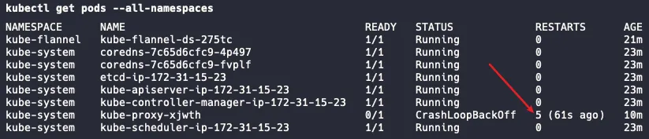

## The First Problem
Recently, when using kubeadm to initialize a k8s cluster, I encountered a peculiar problem where my kube-proxy Pod kept restarting. This issue took me a whole afternoon. I checked the Pod's Events, the Log, the Node's usage limits, the compatibility of the CNI plugins, and almost everything. The error message was very simple, and it wasn't even an Error, just a Warning, that the Sandbox has changed and therefore it was exiting gracefully. The specific prompt was `Pod sandbox changed, it will be killed and re-created.`



Fortunately, I found some answers in a Kubernetes issue:
https://github.com/kubernetes/kubernetes/issues/110177

This seems to be a problem with CRI compatibility under some of the latest versions of Ubuntu. I tried modifying the settings, but it didn't work, so I guess I need to delve deeper into the root of the problem. As I continued to delve deeper, I discovered a discussion that almost had the same issue as mine:
https://discuss.kubernetes.io/t/kubernetes-cluster-back-off-restarting-failed-container-in-kube-system-namespace/26971

Eventually, I found a detailed explanation in a corner of the official documentation:
https://kubernetes.io/docs/setup/production-environment/container-runtimes/#containerd

**I attempted to read through all the documentation and understand the reason behind this issue:**

In Linux, they use a technology called control groups to limit the resources allocated to processes. Both kubelet and the underlying container runtime **need** to interact with control groups. They use a cgroup driver to set control groups, so it's necessary to make sure they are using the same cgroup driver. The default cgroup driver in kubelet is called `cgroupfs`, while when choosing systemd as the init system for the Linux distribution, it has its own cgroup driver, namely the systemd cgroup driver, which providesA higher level of abstraction (on top of `cgroupfs`), allows other programs that need to modify control groups (various containerized programs) to avoid directly operating on `cgroupfs`.

In Ubuntu, the systemd cgroup driver is used. At this time, if kubelet or one of the container runtimes directly uses `cgroupfs`, it may lead to **two unsynchronized views** (which is equivalent to two cgroup managers managing control groups at the same time), leading to some instability. So **the best solution** is for both kubelet and the container runtime to use the systemd cgroup driver.

Fortunately, I am using a k8s cluster created by kebeadm, and it sets cgroupDriver to `systemd` by default starting from v1.22. But why did I still encounter errors?

That's the unfortunate part:(

The underlying container runtime I am using is the pre-configured containerd in the installed docker. This version of containerd defaults to use `cgroupfs`,` which is to ensure compatibility with Docker's traditional configuration. In fact, if I had downloaded containerd from the official website, I would not have this problem, as they had updated to use condition systemd cgroup driver by default three months ago.

So here is my current situation:

1. My kubelet uses the systemd cgroup driver.
2. My container runtime, containerd, uses the `cgroupfs` driver.

This leads to the coexistence of two sets of cgroup managers, causing some resource management inconsistencies.

I checked the github repository of containerd and found a solution.

<https://github.com/containerd/containerd/blob/main/docs/cri/config.md>

The solution is simple, edit the default configuration of the containerd I am using, and change it to use the systemd cgroup driver by default.

```shell
sudo mkdir -p /etc/containerd/

containerd config default | sudo tee /etc/containerd/config.toml

sudo sed -i 's/SystemdCgroup \= false/SystemdCgroup \= true/g' /etc/containerd/config.toml
```Next:

```shell
sudo systemctl restart containerd
```

Reinitialize the k8s cluster. Excellent, the problem is resolved:)

## Another Problem

Later in the deployment, I discovered a severe issue — the container could not correctly shut down when it crashed and remained in the Terminating phase consistently. I tried manually killing the process, and it didn't work. I saw the same problem in the containerd's issues, which seems to be an unresolved problem: https://github.com/containerd/containerd/issues/10542. After an investigation, I understood the whole picture and provided the answer and relevant references below.


However, I eventually discovered the cause in the issues repository of **runc**, which is a core dependency of **containerd**. In simple terms, it's due to the incompatibility between runc and the Apparmor policy of Ubuntu 24.04. I had two solutions, one was to use an updated version of containerd, but this meant that I had to reinstall containerd, runc, etc., and reconsider all kinds of compatibility issues. Therefore, to bypass the problem, I opted to use the Ubuntu 22.04 image, and this issue was finally resolved.

## Afterword

Though these problems consumed a lot of my time, I am grateful for them. In the process of solving these problems, I inevitably learned the underlying principles of k8s, what CNI is, what the kube-proxy component is for, what CRI is, what key components build the container runtime containerd I use, what the cgroup driver is, etc. It was the series of strange problems I encountered that gave me the opportunity to gradually understand them and appreciate their indispensable parts in the k8s system.