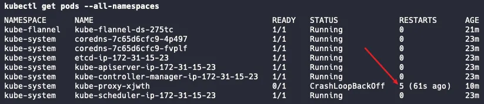
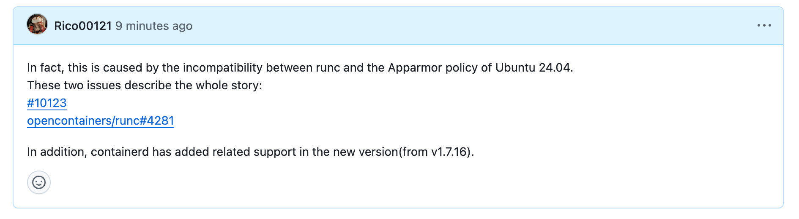

## 第一个问题
最近，我在使用kubeadm初始化k8s集群时遇到了一个诡异的问题，我的kube-proxy Pod总是重启。这个问题花费了我一个下午的时间，我检查了Pod的 Events，检查了 Log，检查了节点的用量限制，检查了 CNI 插件的兼容性，检查了几乎一切。它的报错很简单，甚至不是 Error 仅仅是一个 Warning，说是 Sandbox Changed，所以优雅的退出了。具体的提示是 `Pod sandbox changed, it will be killed and re-created.`



不过好在最后我在 kubernetes 的 issue 中找到了一些答案的影子:
https://github.com/kubernetes/kubernetes/issues/110177

这看起来好像是 Ubuntu某些最新版本下CRI兼容性问题，我尝试修改了配置，但是没有生效，我想我可能需要深入研究一下问题的根源。随着深入了解我发现了一篇讨论，它的问题几乎跟我一样：
https://discuss.kubernetes.io/t/kubernetes-cluster-back-off-restarting-failed-container-in-kube-system-namespace/26971

最终，我在官方文档的某个角落里找到了详细的解答：
https://kubernetes.io/docs/setup/production-environment/container-runtimes/#containerd

**我尝试阅读所有的文档，搞懂了背后的原因：**

在 Linux 上，他们使用 control groups 这种技术来限制分配给进程的资源。kubelet 和底层容器运行时**都需要**与control groups交互，他们使用 cgroup 驱动程序来设置control groups，所以需要确保他们使用相同的 cgroup 驱动程序。kubelet中默认的cgroup驱动程序叫做`cgroupfs`,而当选择systemd作为 Linux 发行版的 init 系统时，它拥有自己的cgroup驱动，也就是systemd cgroup驱动程序，它提供了一种更高层级的抽象（在`cgroupfs`的更上一层），让其他需要修改control groups的程序（各种容器化程序）不用直接操作`cgroupfs`。

在 Ubuntu 中使用的是systemd cgroup驱动，这时如果kubelet或者容器运行时中的某一个直接使用`cgroupfs`可能就会导致**存在两个不同步的视图**（等于说有两个 cgroup 管理器同时在管理 control groups），从而导致一些不稳定发生。 所以**最好的解决方案**是kubelet和容器运行时都使用systemd cgroup 驱动。

幸运的是我使用的是kebeadm创建的k8s集群，它从v1.22开始默认默认设置cgroupDriver为`systemd` 。但是我为什么依旧出现了错误呢？

这就是不幸的部分:(

我使用的底层容器运行时是安装的docker中预配置的containerd，这个版本的containerd默认使用 `cgroupfs` ，它这么做是为了兼容 Docker 的传统配置。其实如果我从官网下载containerd就不会遇到这个问题，它在三个月前更新了默认使用systemd的cgroup驱动。

所以我现在的情况是:

1. 我的kubelet使用的是systemd的cgroup驱动。
2. 我的容器运行时containerd使用的是`cgroupfs` 驱动。

这导致同时存在两套 cgroup 管理器，造成了一些资源管理不一致问题。

我查看了containerd的 github 仓库，找到了解决方案。

<https://github.com/containerd/containerd/blob/main/docs/cri/config.md>

解决方案很简单，修改我使用的containerd的默认配置，改为默认使用systemd的cgroup驱动。

```shell
sudo mkdir -p /etc/containerd/

containerd config default | sudo tee /etc/containerd/config.toml

sudo sed -i 's/SystemdCgroup \= false/SystemdCgroup \= true/g' /etc/containerd/config.toml
```

紧接着：

```shell
sudo systemctl restart containerd
```

重新初始化k8s集群，好，问题解决了: )

## 另一个问题

在后面的部署中，我又发现了一个严重的问题，容器在崩溃时不能够被正确的关闭，它一直处在 Terminating 阶段，我尝试着手动杀死进程，也失效了。我在 containerd 的issues也看到了同样的问题，这看起来是一个悬而未决的问题：
https://github.com/containerd/containerd/issues/10542
我经过一番调查了解了事情的全貌，并在下面做出了解答和相关引用。


不过我最终在**containerd** 的底层依赖 **runc** 的仓库的 issues 中发现了原因，简单来说，这是由于 runc 与 Ubuntu 24.04 的 Apparmor 策略不兼容造成的。我有两个解决方向，一是使用更新的  containerd版本，但是这意味着我需要重新安装 containerd, runc 等等并重新考虑各种兼容性问题，所以为了能够绕过问题，我改为使用 Ubuntu 22.04镜像，这个问题最终也解决了。

## 后记
这些问题虽然花费了我很长的时间，但是很感谢这些问题，在解决问题的过程中，我不可避免的学习了k8s的底层原理，什么是 CNI，kube-proxy 组件是干什么的，什么是 CRI，我所使用的容器运行时 containerd 是由什么关键组件构建的，cgroup驱动是什么等等一系列。正是我遇到了一系列诡异的问题给了我机会去逐步的了解他们，感受到他们在k8s系统中不可或缺的部分。


