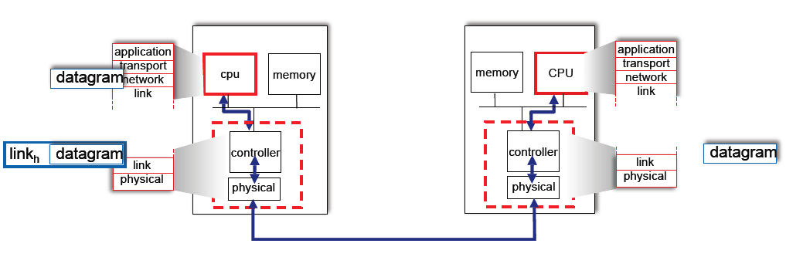
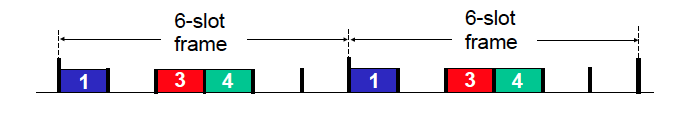
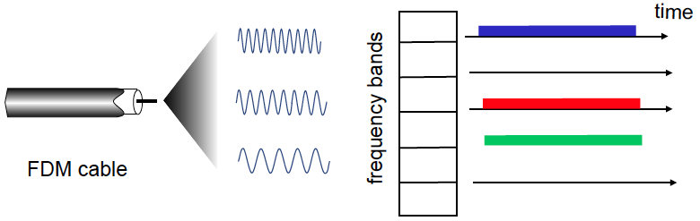
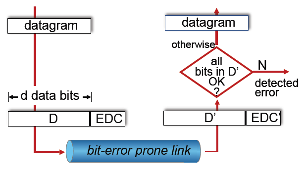
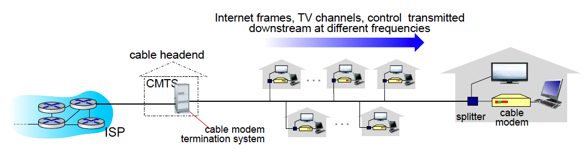
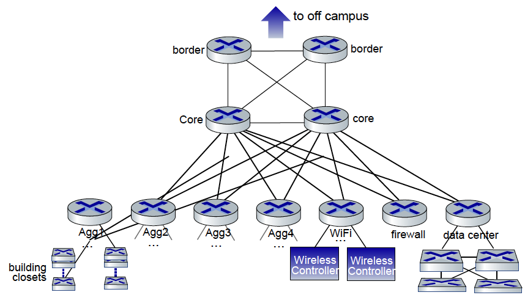

Recently, I've been reorganizing my knowledge of computer networks, and while going through my notes, I suddenly realized that the link layer, which we often consider "too low-level," actually contains many core issues. Particularly, while reviewing the MAC protocol, I was reminded of my previous confusions when learning CSMA/CD and began to ponder why we still need to study these "technologies that have long been replaced by switches" today.

This blog serves as a record, attempting to re-examine what the link layer truly does, starting from the basics, and the role that the MAC protocol plays in our modern networks.

## What Does the Link Layer Do?

We all know that network protocols are layered, with the most common structure being the five-layer model (sometimes the seven-layer OSI model). The link layer is the closest to the physical layer. Many people consider the link layer to be very "low-level" and too distant from us, but in fact, it addresses very fundamental and critical issues.

The core responsibility of the link layer can be summarized in one sentence:

> Responsible for transferring IP layer datagrams from one node to the adjacent node.

There are two key terms here:

- **node**: This can be a host or a router;
- **frame**: The unit processed by the link layer; we encapsulate datagrams (data from the IP layer) into frames for transmission.

The link layer not only encapsulates frames (adding headers and trailers) but also has to consider many practical issues:

- If the link is shared (such as WiFi), how do we decide who sends data first? (Multiple Access)
- What kind of addresses should be used to identify devices? (Using MAC addresses, not IP addresses)
- What should be done if the link quality is poor or the channel is unstable? Should error detection be implemented?

In reality, there is a wide variety of link layer protocols, such as Ethernet, Wi-Fi, Bluetooth, and even the underlying technologies of 4G/5G include link layer logic. Moreover, not all link layers provide reliable transmission, which leaves room for the transport layer to play its role. This is why transport layer protocols like TCP still need to implement reliability mechanisms. An end-to-end path often includes multiple links, and we cannot assume that every hop guarantees error-free and loss-free data transfer. Therefore, a higher-layer, more abstract and unified protocol must ensure reliable data transmission in a comprehensive end-to-end manner.

---

## The History and Evolution of the MAC Protocol

In the link layer, MAC is one of the most frequently mentioned keywords.

MAC stands for **Medium Access Control**. To put it simply, it refers to handling the control and management of accessing the physical medium.The problem being addressed is as follows:

> When multiple devices share a single transmission medium (such as a network cable or the same Wi-Fi channel), who gets to send data first? How is data sent? Can others hear it when someone is transmitting?

This issue is known as the Multiple Access problem. Protocols that solve this problem are collectively called **MAC (Medium Access Control) protocols**.

Most of our current networks are point-to-point, for example, the link between a computer and a switch is exclusive, so it might seem like there isn't any sharing. However, in reality:

- In early bus structures (Bus Ethernet), all hosts were really just connected to a single line;
- In modern Wi-Fi networks, everyone shares the medium of **air**, which still requires a MAC protocol for coordination.

Implementation strategies for MAC protocols can be divided into three categories:

### 1. Channel Partitioning

The medium is divided so that each device gets a fixed segment of the resources.

- TDMA (Time Division Multiple Access): Each device takes turns to send data in its own time slot.
  
- FDMA (Frequency Division Multiple Access): Each device uses a different frequency band, similar to radio tuning.
  

### 2. Random Access

Everyone can send data, but they need to “listen” first before sending and back off if there is a collision.

- CSMA: Carrier Sense Multiple Access, where devices listen for signals before sending;
- CSMA/CD: An old method used in wired Ethernet, devices listen as they send and stop if there is a collision;
- CSMA/CA: Used in wireless (Wi-Fi) to avoid collisions rather than detect them;
- ALOHA: Used in early satellite communications, with pure random sending. Nodes do not listen to the channel; they send data directly. If a collision occurs, the sender does not immediately detect it but waits for a random time before retransmitting.

### 3. Taking Turns

The system enforces a turn-taking mechanism, which is fairer, though not necessarily highly efficient.

- Token Passing: The device holding the "token" gets to send data, as seen in Token Ring networks;
- In distributed systems, this concept evolves into various "mutual exclusion algorithms."

Although CSMA/CD is not used in home networks today, Wi-Fi still extensively uses CSMA/CA. Industrial networks, satellite communications, low-power IoT, and other fields also frequently use polling and time division MAC protocols.

---

## Error Detection Mechanisms in the Link Layer

The link layer cannot always guarantee transmission "without error." In reality, electromagnetic waves can be interfered with by rain, Wi-Fi signals can be affected by microwaves, and cables can age, all of which can cause bit flips or losses.

To attempt to detect these issues...In order to detect errors, we add a checksum value to each frame, the most common being CRC (Cyclic Redundancy Check).

It works roughly as follows:

- The sender generates a checksum using a fixed algorithm based on the content of the frame and appends it to the end of the frame.
- The receiver computes the checksum using the same algorithm upon receiving the frame to see if it matches the received checksum.
- If there's a mismatch, it indicates an error in the frame, which is then discarded.

The link layer performs error detection, but whether or not to retransmit depends on the protocol itself:

- Ethernet discards erroneous frames and does not retransmit.
- Wi-Fi waits for an ACK, and if not received, it will automatically retransmit.

So why is TCP still needed to ensure reliability? Because the link layer is only responsible within a "single hop" and may not be reliable. TCP, on the other hand, is end-to-end, serving as the final safeguard.

---

## In Modern Networks, CSMA/CD Has Become a Thing of the Past

CSMA/CD originated in the era of "shared bus Ethernet" where all devices were connected to a single bus, and anyone wishing to send a packet had to "listen to see if anyone else was talking."

But we have long since moved past that era. The structure of today's networks is as follows:

- Each host connects to a switch via a dedicated link.
- The switch maintains a forwarding table and forwards frames to the target device as needed.
- Each link is point-to-point, with no mutual interference, and thus naturally free of collisions.

Therefore, modern Ethernet is **full-duplex and switch-based**, effectively eliminating the possibility of "collisions" and rendering CSMA/CD unnecessary.

Nonetheless, understanding **why CSMA/CD appeared, how it worked, and how it was replaced** is still crucial for comprehending the evolution of network protocols. It tells us that **the MAC protocol hasn't disappeared but rather "evolved."**

In the next blog post, we will explore how switches and MAC addresses work together to make Ethernet more efficient and orderly.