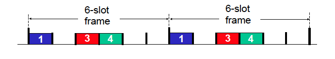
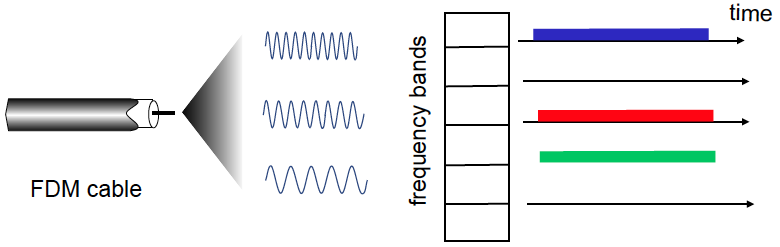
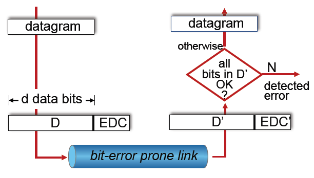
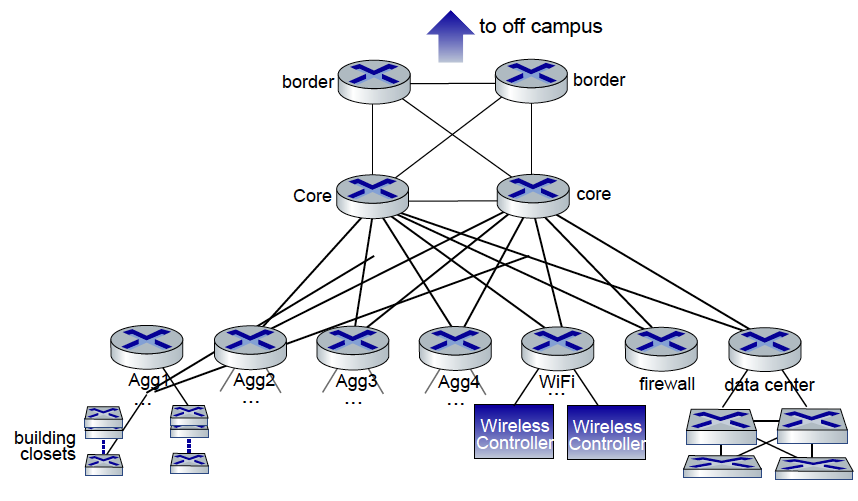

最近在重新梳理计算机网络的知识体系，翻阅讲义的时候忽然意识到：链路层这个我们总觉得"太底层"的部分，其实埋藏着很多非常核心的问题。特别是在复习 MAC 协议的时候，我突然想起了以前学 CSMA/CD 的时候的困惑，也对为什么今天我们还要学习这些"早就被交换机淘汰的技术"产生了很多思考。

这篇博客就作为一个记录，试着从基础出发，重新梳理一下链路层到底在做什么，MAC 协议又在我们现代网络中扮演着怎样的角色。

## 链路层是干什么的？

我们都知道网络协议是分层的，最常见的结构是五层模型（有时是七层 OSI）。而链路层（Link Layer）就是离物理最近的一层了。很多人觉得链路层很“低级”，离我们太远，但实际上它解决的问题非常基础，也非常关键。

链路层的核心职责可以用一句话总结：

> 负责将 IP 层的 datagram 从一个节点传到相邻的另一个节点。

这里有两个关键术语：

- **node**：可以是主机（host），也可以是路由器（router）；
- **frame**：链路层处理的单位，我们会把 datagram（来自 IP 层的数据）封装成一个个帧来传输。

链路层不仅要封装帧（加 header 和 trailer），还要考虑很多实际问题：

- 如果链路是共享的（比如 WiFi），那该怎么决定谁先发数据？（Multiple Access）
- 该用什么样的地址来识别设备？（用的是 MAC 地址，不是 IP 地址）
- 如果链路质量差、信道不稳定怎么办？要不要检测错误？

现实中链路层协议五花八门，比如以太网（Ethernet）、Wi-Fi、蓝牙、甚至 4G/5G 的底层都有链路层逻辑。而且，不是所有链路层都提供可靠传输，这就为传输层留了发挥空间。这也是为什么像 TCP 这样的传输层协议仍然需要实现可靠性保障机制。因为一条端到端的路径往往包含多个链路，而我们无法假设每一跳都能保证数据不出错、不丢失。所以必须由更高一层、抽象统一的协议，在端到端的范围内负责整体的数据可靠传输。

---

## MAC 协议的来龙去脉

在链路层中，MAC 是最常被提到的关键词之一。

MAC 是 **Medium Access Control** 的缩写，翻译成中文是“媒介访问控制”。说白了，它解决的是这样一个问题：

> 当多个设备共享一根传输介质（比如一根网线、同一个 Wi-Fi 频道）时，谁先发？怎么发？发了别人能不能听到？

这个问题叫做 Multiple Access（多路访问）问题。解决这个问题的一类协议，统称为 **MAC 协议**。

我们现在的网络大多数是点对点的（point-to-point），例如电脑和交换机之间是独占链路，所以听起来好像没什么共享。但实际上，

- 早期的总线结构（Bus Ethernet）中，所有主机真的就是插在一根线上的；
- 而现代 Wi-Fi 网络，大家共享**空气**这个媒介，仍然需要 MAC 协议来协调。

MAC 协议的实现策略可以分为三类：

### 1. Channel Partitioning（划分信道）

把媒介进行划分，让每个人固定用一段资源。

- TDMA（时分）：每台设备轮流在自己的时间片发送；
  
- FDMA（频分）：每台设备用不同频段，类似收音机调频。
  

### 2. Random Access（随机接入）

大家都可以发，但发之前要先“听”，有冲突再退避。

- CSMA：监听有无信号再发；
- CSMA/CD：有线以太网的老方法，边发边听，有冲突就停；
- CSMA/CA：无线中用的（Wi-Fi），避免冲突而不是检测冲突；
- ALOHA：早期卫星通信使用，纯随机发送。节点不监听信道，直接发数据，如果发生冲突，发送方不会立即发现，而是等待一段随机时间后再重传。

### 3. Taking Turns（轮流发）

系统强制大家轮着来，比较公平但效率不一定高。

- Token Passing：谁拿到“令牌”谁发数据，Token Ring 网络就是这样；
- 在分布式系统中，这种思想演化成了各种“互斥算法”。

虽然我们家里的网络现在用不上 CSMA/CD，但 Wi-Fi 依然大量用着 CSMA/CA。工业网络、卫星通信、低功耗物联网等领域也经常用到轮询、时分这样的 MAC 协议。

---

## 链路层的错误检测机制

链路层不是总能保证传输“完好无损”。现实中，电磁波可能被雨水干扰、Wi-Fi 信号可能被微波炉影响、线缆可能老化，都会造成比特翻转或者丢失。

为了尽量发现这些错误，我们会在每一帧后面加一个校验值，最常见的就是 CRC（循环冗余校验）。

它的工作方式大致是：

- 发送方根据帧内容生成一个固定算法的校验值，加到帧末尾；
- 接收方收到帧后用相同算法计算一次，看和收到的校验值是否一致；
- 如果不一致，说明帧出错了，直接丢弃。

链路层做了错误检测，但**是否重传**，取决于协议本身：

- Ethernet（以太网）出错就丢，不重发；
- Wi-Fi 会等 ACK，如果没收到就自动重发。

那为什么还要 TCP 做可靠性保证呢？因为链路层只在“一跳”内负责，而且可能并不可靠。而 TCP 是端到端的，是最后的保险。

---

## 在现代网络中，CSMA/CD 已成为历史

CSMA/CD 诞生于“共享总线以太网”的年代，所有设备挂在一根线（Bus）上，谁想发包就得先“听听有没有人说话”。

但现在我们早已过了那个时代。现在的网络结构是：

- 每台主机通过独立的链路接入交换机；
- 交换机维护转发表，按需将帧转发到目标设备；
- 每个链路都是点对点的，互不干扰，天然没有冲突。

所以现代以太网都是 **全双工 + 交换结构**，压根没有“冲突”的土壤，自然也不需要 CSMA/CD。

不过，**理解 CSMA/CD 为什么出现、怎么工作、怎么被替代**，仍然对理解网络协议演化很重要。它告诉我们，**MAC 协议并不是消失了，而是被“进化”了**。

下一篇博客我们就可以深入交换机和 MAC 地址是如何配合，让“以太网”变得高效有序的。