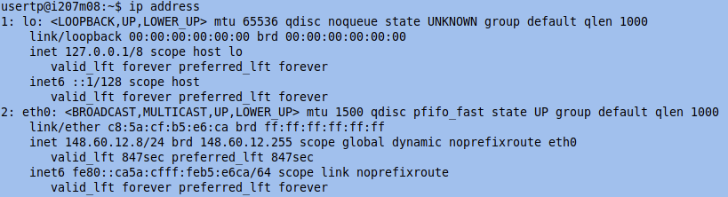
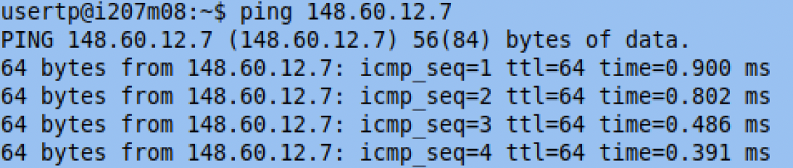
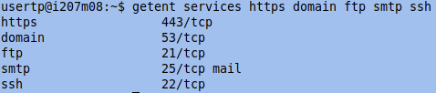
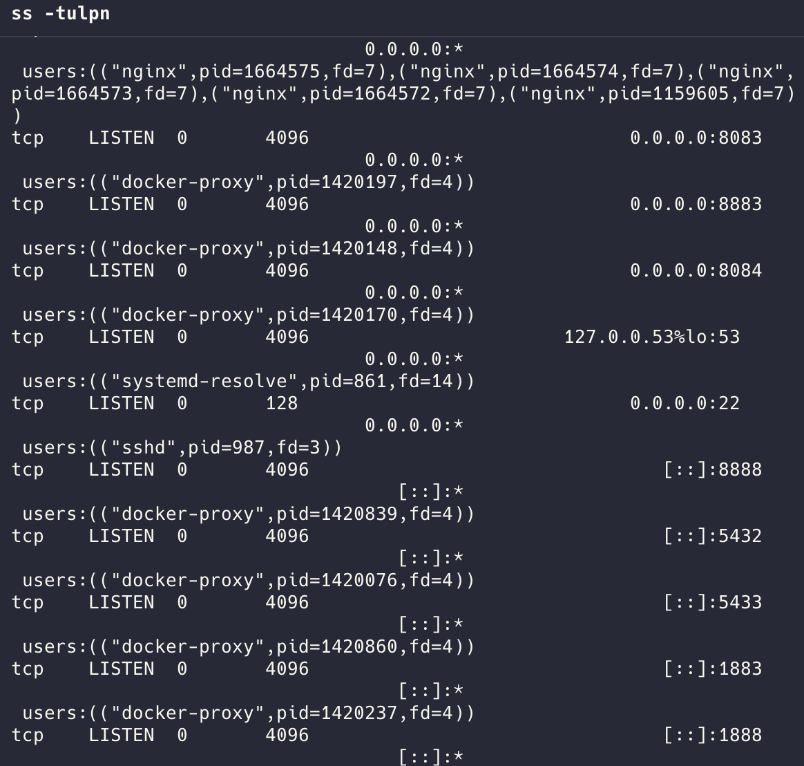
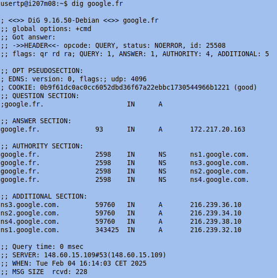
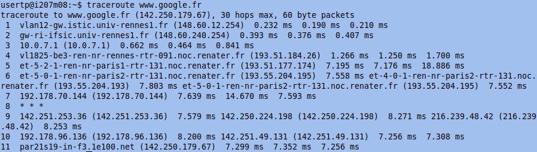

# Mastering Network Command-Line Tools: A Practical Guide

## Introduction

Network troubleshooting and diagnostics are essential for system administrators, developers, and network enthusiasts. Understanding how to retrieve system information, query DNS records, analyze network connections, and inspect packet details is crucial. This blog will introduce various Linux network command-line tools based on practical experiments.

## 1. Get system and network information
### **`hostname` - Get system hostname**
The `hostname` command is used to get the hostname of the system.
```bash
hostname
```
This command returns a unique name that identifies the computer on the network.


### **`ip` - Display network interface information**
To get detailed network information, use:
```bash
ip address
```
This command displays the IP address assigned to each network interface. For example:


```
eth0: 148.60.12.8/24
```
Here, `148.60.12.8` is the IP address, and `/24` represents the subnet mask `255.255.255.0`.

## 2. Connectivity Testing

### **`ping` - Check Host Availability**

To check if a host is online, use:

```bash
ping 148.60.12.7
```



If the host responds, it means the device is online; otherwise, it may be offline or blocked by a firewall.

### **`nslookup` - Query DNS Records**

To query the DNS records for a domain, use:

```bash
nslookup 148.60.12.7
```


This tool helps resolve domain names and check their DNS configurations.

## 3. Querying System Databases

### **`getent` - Query System Databases**

The `getent` command fetches entries from system databases such as `/etc/passwd`, `/etc/group`, `/etc/hosts`, and `/etc/services`. For example, to query commonly used services:

```bash
getent services https domain ftp smtp ssh
```



This command retrieves information about respective network services.

## 4. Checking Active Network Connections

### **`ss` - View Socket Statistics**

The `ss` command provides detailed insights into network connections:

```bash
ss -tulpn
```



This displays active TCP/UDP connections and the processes using them.

## 5. Querying DNS Resolution Records

### **`dig` - Advanced DNS Query**

To fetch detailed DNS information:

```bash
dig google.fr
```



This command returns DNS resolution data, including authoritative name servers.

## 6. Tracing Network Routes

### **`traceroute` - Track Packet Route**

To trace the route packets take to reach a destination:

```bash
traceroute google.fr
```



This displays each hop along the route and is useful for diagnosing network latency or routing issues.

## Conclusion

Mastering these command-line tools enhances network troubleshooting skills and enables efficient debugging. Whether checking DNS records, analyzing connections, or monitoring packet flow, these commands form the foundation of network diagnostics. Understanding their practical applications is essential for anyone working with networks. 