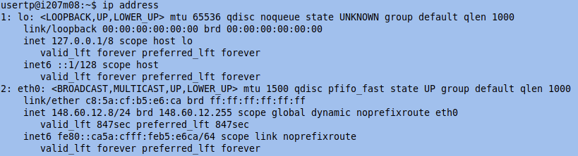
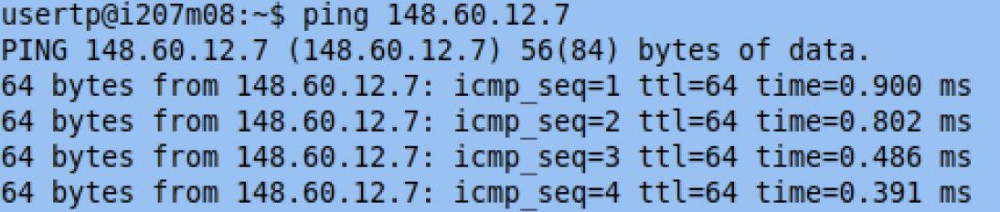
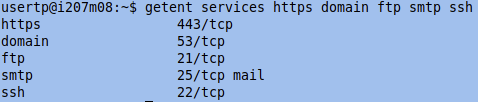
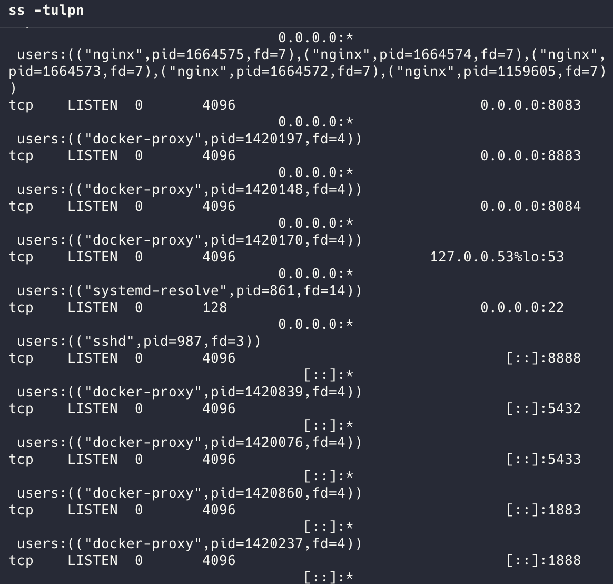
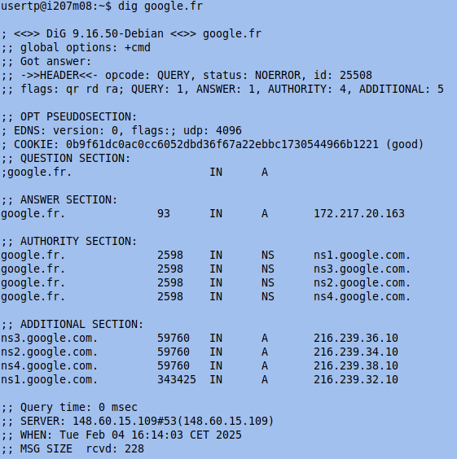
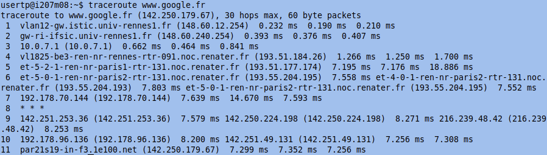

## 介绍
对于软件工程师来说，了解如何获取系统信息、查询 DNS 记录、分析网络连接以及检查数据包细节至关重要。本博客将基于实际实验，介绍 Linux 下的各种网络命令行工具。

## 1. 获取系统和网络信息
### **`hostname` - 获取系统主机名**
`hostname` 命令用于获取系统的主机名。
```bash
hostname
```
此命令返回标识计算机在网络中的唯一名称。


### **`ip` - 显示网络接口信息**
要获取详细的网络信息，可使用：
```bash
ip address
```
此命令显示分配给每个网络接口的 IP 地址。例如：

```
eth0: 148.60.12.8/24
```
其中 `148.60.12.8` 是 IP 地址，`/24` 代表子网掩码 `255.255.255.0`。

## 2. 连接性测试
### **`ping` - 检测主机是否可达**
要检查主机是否在线，可使用：
```bash
ping 148.60.12.7
```


如果主机有响应，则表示该设备在线，否则可能是离线或被防火墙拦截。

### **`nslookup` - 查询 DNS 记录**
要查询某个域名的 DNS 记录，可使用：
```bash
nslookup 148.60.12.7
```


此工具有助于解析域名并检查其 DNS 配置。

## 3. 查询系统数据库
### **`getent` - 查询系统数据库**
`getent` 命令可从 `/etc/passwd`、`/etc/group`、`/etc/hosts`、`/etc/services` 等系统数据库中获取信息。例如，查询常见的网络服务：
```bash
getent services https domain ftp smtp ssh
```


此命令可获取相关的网络服务信息。

## 4. 检查活跃网络连接
### **`ss` - 查看套接字状态**
`ss` 命令提供有关网络连接的详细信息：
```bash
ss -tulpn
```


此命令显示活动的 TCP/UDP 连接及其对应的进程。

## 5. 查询 DNS 解析记录
### **`dig` - 高级 DNS 查询**
获取详细的 DNS 解析信息：
```bash
dig google.fr
```


此命令返回 DNS 解析数据，包括权威名称服务器。

## 6. 跟踪网络路由
### **`traceroute` - 跟踪数据包路由**
跟踪数据包到达目标的路径：
```bash
traceroute google.fr
```

此命令显示数据包经过的每一跳，适用于排查网络延迟或路由问题。

## 结论
掌握这些命令行工具可以提高网络故障排除能力，并帮助高效调试。无论是检查 DNS 记录、分析连接还是监控数据包流，这些命令构成了网络诊断的基础。了解它们的实际应用对于任何从事网络工作的人来说都是必不可少的。


