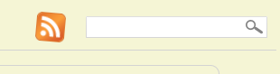
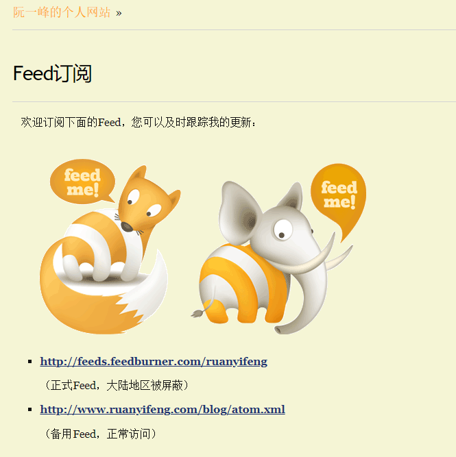
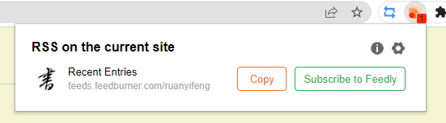

## Preface

While looking at Ruan Yifeng's personal blog, I noticed a yellow WIFI icon in the top right corner, which made me realise that I seem to have seen it on a lot of personal blogs.

Follow the link and click on it, it's an xml formatted file that records the information on the blog in some special specification.

Driven by curiosity, I have explored and experimented with it, and finally produced this blog to share this interesting "tool" with you.

## RSS
The full name of RSS is [RDF](https://zh.wikipedia.org/wiki/%E8%B3%87%E6%BA%90%E6%8F%8F%E8%BF%B0%E6%A1%86%E6%9E%B6) Site Summary, and some people call it Really Simple Syndication. Syndication, or in some cases **Really Simple Syndication**. RSS is the common name for a class of source format specifications that aggregate updated content from multiple websites and automatically notify subscribers to those websites. Used to provide this information resource specification can be called RSS, common RSS specification *rss* and *atom* two kinds of specific can google. as for how to use this information resource, then have to mention Feed.

## Feed
We often hear about feed streams, which are a class of applications used to follow and subscribe to websites; it's a tool, or reader, that allows you to subscribe to various websites of interest in **one place**. A more typical use is to subscribe to blog posts.

For various reasons, many bloggers have built their own private blog sites. It's fine for us to follow one or two bloggers, but when we follow many bloggers at the same time, we often can't get the news at the first time because their update time is not fixed. At this point, the advantage of Feed is reflected, the use of Feed reader, just like the blog's Feed stream link to add to the reader, in their own Feed reader, you can see all the subscribed bloggers in a timely manner of information, they have read, they have not yet read, and you can subscribe to all the arbitrary classification of the columns.

Feed is used to subscribe to your favourite bloggers in addition to everything else that **could be updated** with resource content, in theory. You can subscribe to your favourite uploader on your feed reader and follow his contribution updates; you can add a specific section of a news site that you want to follow for the latest news; you can add your favourite Taobao shop and follow its product updates; you can subscribe to repositories on Github that will notify you of repository updates in a timely manner, or even the university's faculty website bulletin board! ...... is like the title of the article says, when you use Feed, **everything can be subscribed**.

## Common Feed Readers
The most common feed readers on the market are Feedly and Inoreader, of course, if you are an Apple user, then Reeder 5 is highly recommended, with a simple interface and no annoying adverts, but the trouble is that this app has been taken down in China, so you need to go through a bit of trouble to download it in the U.S. region.

Of course, if you have some special needs, you can also build your own feeds on your own server, such as Tiny Tiny RSS and FreshRss.

As for how to quickly get the feed link of the website you want to subscribe, it is recommended to install the browser plugin RSSHub Radar, which can help you to quickly find the current page on the Internet, whether there is a feed link, and to help you subscribe it to your feed reader with one click.

## How the Feed Works
Usually, the website will provide you with a feed URL, usually an icon that can be directly clicked to jump to, but there are also some hidden in the html format of the link tags, you need to look for them properly. Users only need to register the URL provided by the website into their own feed reader, then they can subscribe to the latest news.

So this time there are small partners will ask, if the site does not provide Feed interface how to do? Then you can only write your own crawler, through the crawler to get the current site html, and according to rss or atom format specification for data conversion, you can give the Feed reader to use.

Of course, will not write their own crawler does not matter, the gods DIYGod has been open source on Github to generate a Feed link project RSSHub, which is an open source, easy to use, easy to expand the RSS generator, you can give any strange content to generate RSS feeds. Interested partners can view its own [official documentation](https://docs.rsshub.app/), has generated most of the Feed source you can think of, the more commonly used browser extension RSSHub Radar is also based on this development.

Feed reader implementation principle is actually very simple, after subscription, the reader through the polling of the pull mechanism, every once in a while through the interface call traverses all the registered URL, check for updates. After the reader gets the data in rss or atom format, what style should be displayed on the reader and what data should be displayed, that is its business.

## Thoughts on why you should use RSS
There are three advantages I see in using RSS for information access. Firstly, as mentioned above, it is truly a content aggregator, integrating everything you need to get information in your daily life into one place (catching up on dramas, race schedules, updates from your favourite bloggers), saving you from the torture of pop-ups from various apps.

Secondly, using it for message subscription doesn't require you to reveal your personal information, you don't need to find out what you want to follow by adding your followers like other social apps, which more or less guarantees the privacy of your followers. Adding a feed is similar to email, except that an email subscription also requires an email address to be provided to the site, as well as the possibility of spam harassment.

The last point is that using RSS, or feeds, completely eliminates the poisonous effects of recommendation algorithms; feeds are ostensibly about aggregating resources, but they are much more than that. Today, all kinds of APP has long become no longer pure, a variety of recommendation algorithms flying all over the place, Zhihu, Xiaohongshu, jittery voice ...... recommendation algorithms exist so that you become more and more like **it thinks you**, we are unconsciously by the meaningless recommendation of the content to waste too much time, but enjoy it. Technology shouldn't be used to control humans, using RSS, can give you the opportunity to **decide for yourself what you want to read**.

## Bits of news
I was thinking that the inventor of such a big format must be an amazing person and searched the internet for information about him or them. This led me to such a person, Aaron Hillel Swartz, who was involved in the development of the RSS message source publishing format, the Markdown text publishing format, the Creative Commons, the web.py web development framework, and was the co-founder of the social media Reddit.

He passed away in 2013, in his prime, and for those interested in his life, you can watch the documentary film "Son of the Internet". I was writing an article using the Markdown formatting specification he wrote, and I felt that the world was missing a true "fighter", a qualified software developer and documentation contributor. I felt sorry for the loss of a real "fighter" in the world, a qualified software developer and document contributor, and I had mixed feelings for a while.

