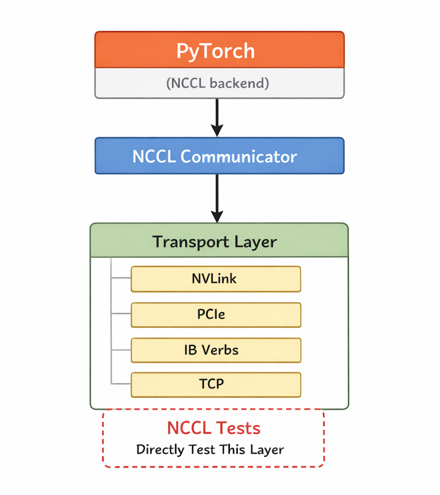

很多初学者，包括之前的我，往往会把 NCCL Tests 理解成一个单纯的性能跑分工具。但更准确地说，它的本质是一个用于探测 InfiniBand 网络底层通信状态的工具，也可以把它理解成一个 GPU cluster communication debugging tool。

之所以会产生“它只是跑分工具”的印象，是因为 NCCL Tests 的表现形式确实很像 benchmark。但它到底在测什么，其实取决于你选择的通信路径，例如 NVLink、PCIe、Socket TCP，或者基于 RoCE、InfiniBand 的 RDMA。

## 为什么需要 NCCL Tests

在我们当前的系统中，跨机器的分布式训练经常会遇到 `NCCL Timeout` 报错。要排查这类问题，最困难的地方在于真实训练任务本身往往很复杂，既包含模型计算，也包含底层通信。如果直接在训练任务里定位问题，噪声会非常大。

因此，我们需要一种方式，把复杂的算法逻辑剥离掉，只保留训练过程中最核心的底层通信行为。NCCL Tests 的价值就在这里，它相当于一个“通信仿真器”，让我们可以在不依赖完整训练框架的前提下，单独验证通信链路是否正常。

## NCCL 底层通信是如何建立的

在理解 NCCL Tests 之前，最好先把 PyTorch 分布式训练的通信栈放在脑子里：

从这张图中，我们可以看出来：
1. PyTorch 训练逻辑位于最上层。
2. 中间由 NCCL 负责集合通信（Collective Communication）。
3. 最底层才是实际的数据传输路径，例如 NVLink、PCIe、RDMA 或 TCP。

从这个结构里就能看出，NCCL Tests 实际上是在尽量绕开训练框架本身，直接测试最底层的通信能力。

所以你也可以用一个非常直观的方式来理解两者的区别：

1. PyTorch Training = Compute + Communication
2. NCCL Tests = Communication

这也是很多 GPU Infra 工程师理解 NCCL Tests 的方式。它并不关心你的模型算得对不对，而是关心当多个 GPU 或多个节点开始真正交换数据时，通信链路是否健康。

## NCCL Tests 模拟了什么

NCCL Tests 模拟的是从协议握手到真实数据传输的完整生命周期。大体可以分成三个阶段：

### 1. 会合（Rendezvous / Rank Discovery）

在通信开始之前，所有节点需要先完成一次“会合”。这一步的核心作用是确认每个参与者的身份，也就是让每个 rank 互相知道彼此是谁、总共有多少个参与者，以及后续通信所需的地址信息。

这一步通常会借助 MPI 之类的机制，先构建一个临时的主从式协调过程。它的目的并不是长期承载数据传输，而是让整个通信世界先建立基本共识。

### 2. 建立节点链接（Link Creation）

在知道了彼此身份之后，下一步就是把链路真正建立起来。这里的重点并不只是“网络通了没有”，还包括 NCCL 会自动探测 GPU、PCIe、NVLink 和 NIC 的拓扑关系，然后基于这些拓扑信息去生成 ring 或 tree 等通信结构。

也就是说，NCCL 不只是简单地把两台机器连起来，而是在尝试找到一条适合当前硬件拓扑的高效通信路径。

### 3. 形成对等连接（Peer-to-Peer Communication）

当链路建立完成后，节点之间就不再依赖最初的 rendezvous 协调服务了。此时各个参与者已经形成了真正的 P2P 对等连接，可以直接交换数据。

而我们在排查问题时，真正关心的通常就是这个阶段。因为训练任务里的超时、卡死、吞吐异常，大多都发生在节点开始直接通信之后。

## NCCL Tests 的核心排查目标

通过运行 NCCL Tests，我们通常可以比较直接地观察到以下几类问题。

### RDMA 是否真的生效

很多集群从配置上看“像是在跑 IB”，但实际上并没有真正走 RDMA，最后退化成了 `NCCL over TCP`。这种情况在配置复杂的环境里并不少见，而 NCCL Tests 往往能很快把这个问题暴露出来。

### 通信带宽是否异常衰减

即便流量确实走了 IB 或 RoCE，也不代表性能一定正常。你仍然需要确认实际带宽是否明显低于理论值，否则就说明链路、拓扑、交换机配置或者网卡状态中很可能存在问题。

### 节点之间是否存在互通故障

有些问题并不是整个集群都坏了，而是某几个特定节点之间无法稳定互通。这类问题在大规模训练里尤其隐蔽，因为它可能只在某些 rank 组合下触发。NCCL Tests 能帮助我们把这种局部故障尽快识别出来。

### 网络抖动和延迟是否会导致训练崩溃

短时间跑通一次测试，不代表网络就足够稳定。通过更长时间的压测，我们可以观察在高并发通信下是否出现丢包、延迟抖动或超时，从而进一步定位导致分布式训练失败的硬件、链路或路由层问题。

## 总结

NCCL Tests 远不只是一个 GPU 通信 benchmark。更准确地说，它像是 GPU 集群通信链路的“听诊器”。

它的价值在于，通过模拟真实训练中的 collective communication，我们可以绕开复杂的训练框架，把注意力集中在 GPU、PCIe、NVLink 和 RDMA 网络之间的真实通信路径上。这样一来，很多原本在训练任务里很难定位的问题，例如 NCCL timeout、带宽异常、链路不通或者网络抖动，就可以更快地暴露出来。

如果你正在排查分布式训练中的通信问题，那么把 NCCL Tests 当成“底层链路诊断工具”来理解，通常会比把它单纯看作跑分工具更有帮助。
